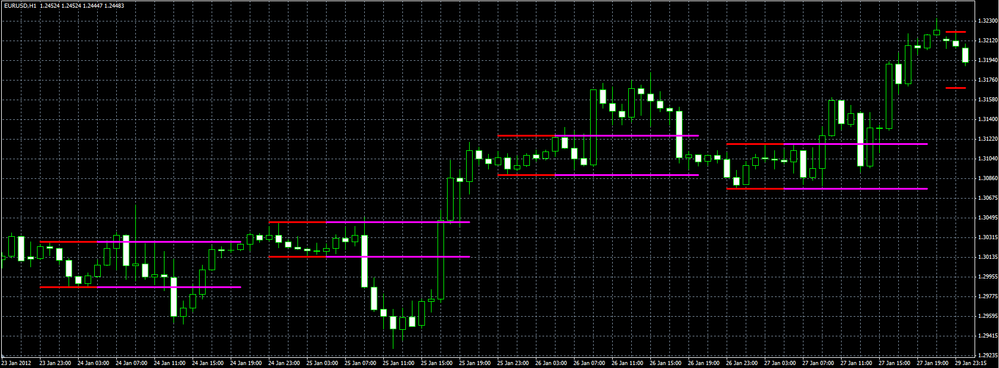

# Breakout indicator

> Source: https://fxcodebase.com/code/viewtopic.php?f=38&t=19944  
> Forum: 38 · Topic 19944 · 5 post(s)

---

## Breakout indicator

**Alexander.Gettinger** · Tue Jun 05, 2012 3:15 pm

The indicator show two zones: "period" and "box". During the period zone the high and low are calculated.

The zones are specified by the hh:mm offset against the beginning of the data (0:00).

 

Download:

 [Breakout.mq4](files/35122/Breakout.mq4)

 [Breakout.mq5](files/35122/Breakout.mq5)

---

## Re: Breakout indicator

**samara** · Fri Jan 03, 2014 8:28 pm

Hello
I cannot download it
I donot have permission to save in this location .conact the admimistrator to obtain permission
How I obtain permission?

---

## Re: Breakout indicator

**Apprentice** · Sun Jan 05, 2014 6:57 am

Can you try to do this again.

I can not find anything wrong with your privileges.
I have also managed to download this one with your credentials.

---

## Re: Breakout indicator

**samara** · Mon Jan 06, 2014 1:01 am

I try many times with many brokers
you can see the messege in attachment file..
I try save it in ACER andmake cut paste but give me a note you see it in attasdment breakout
I clik continue ok it is saved
but it is not work it is not appear with custom
Thank you

---

## Re: Breakout indicator

**Apprentice** · Mon Jan 06, 2014 3:12 am

First, Lua will not work with MT4.

For Mq4/EX4, try this detour.

Save indicators elsewhere, probably on your desktop.
Then Move them to Indicator Folder.
Make sure that the TS is turned off.
