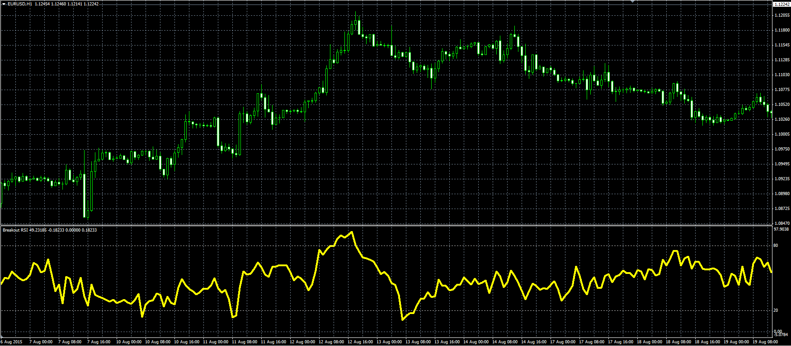

# Breakout Relative Strength Index

> Source: https://fxcodebase.com/code/viewtopic.php?f=38&t=62616  
> Forum: 38 · Topic 62616 · 3 post(s)

---

## Breakout Relative Strength Index

**Alexander.Gettinger** · Mon Aug 31, 2015 11:50 am

Based on Article, The Breakout Relative Strength Index by Howard Wang
September 2015 issue of Technical Analysis of Stocks & Commodities

Formula:
BRSI = 100-100/(1+Pavg/Navg), where
Pavg - average [p] at range from (i-Length+1) to (i),
Navg - average [n] at range from (i-Length+1) to (i),
p = Abs(BPower), if BPower[i]>BPower[i-1], else p = 0,
n = Abs(BPower), if BPower[i]<BPower[i-1], else n = 0,
BPower = BPrice*BStrength*BVolume,
BPrice[i] = (Open[i-1]+Max+Min+Close[i])/4,
BStrength[i] = (Close[i]-Open[i-1])/(Max-Min),
BVolume[i] = Volume[i]+Volume[i-1],
Max = Max(High[i], High[i-1]),
Min = Min(Low[i], Low[i-1]).

 

Download:

 [Breakout_RSI.mq4](files/102107/Breakout_RSI.mq4)

---

## Re: Breakout Relative Strength Index

**kingos497** · Sat Oct 03, 2015 4:19 am

[https://gyazo.com/af33632b691fc0c08067ffb4c5797f7f](https://gyazo.com/af33632b691fc0c08067ffb4c5797f7f)

is it normal we see nothing on chart ?

---

## Re: Breakout Relative Strength Index

**Apprentice** · Thu Oct 08, 2015 5:02 am

I can not confirm your observation.
