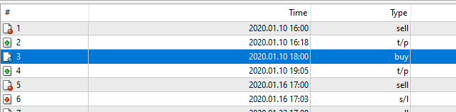

# Breakout_Str

> Source: https://fxcodebase.com/code/viewtopic.php?f=38&t=70742  
> Forum: 38 · Topic 70742 · 4 post(s)

---

## Breakout_Str

**Apprentice** · Mon Dec 21, 2020 2:48 am

Based on TS2/Lua version.
[viewtopic.php?f=31&t=2639](https://fxcodebase.com/code/viewtopic.php?f=31&t=2639)

 [Breakout_Str.mq4](files/139719/Breakout_Str.mq4)

 [Breakout_Str.mq5](files/139719/Breakout_Str.mq5)

---

## Re: Breakout_Str

**Dewara92** · Mon Dec 21, 2020 4:28 pm

> **Apprentice wrote:**
> Based on TS2/Lua version.
> [viewtopic.php?f=31&t=2639](https://fxcodebase.com/code/viewtopic.php?f=31&t=2639)
>
>
> Breakout_Str.mq4
>
>
>
>
> Breakout_Str.mq5

Thanks for this!

So it only opens trades or stops/limits once a day for a chart?

I haven't received a trade but I am assuming because it's waiting for new day?

---

## Re: Breakout_Str

**Apprentice** · Tue Dec 22, 2020 4:27 am

Your request is added to the development list.
Development reference 2516.

---

## Re: Breakout_Str

**Apprentice** · Thu Dec 24, 2020 8:31 am

