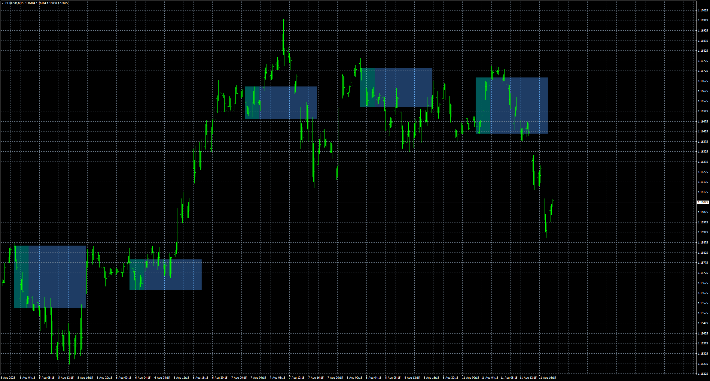
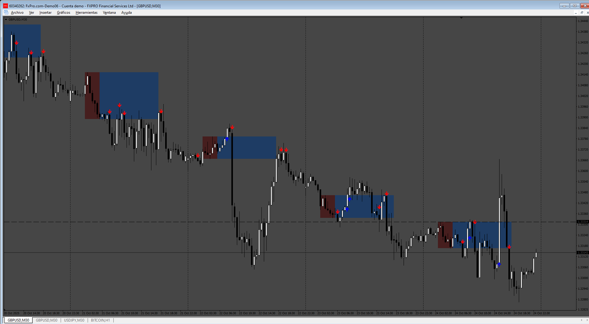

# BreakoutBoxAlert

> Source: https://fxcodebase.com/code/viewtopic.php?f=38&t=76233  
> Forum: 38 · Topic 76233 · 4 post(s)

---

## BreakoutBoxAlert

**Apprentice** · Mon Aug 11, 2025 11:37 am

Based on the request.
[https://fxcodebase.com/code/viewtopic.p ... 60#p148160](https://fxcodebase.com/code/viewtopic.php?f=27&p=148160#p148160)

 [Breakout Box.ex4](files/160215/Breakout%20Box.ex4)

 [BreakoutBoxAlert.mq4](files/160215/BreakoutBoxAlert.mq4)

---

## Re: BreakoutBoxAlert

**khanatd** · Tue Oct 21, 2025 12:15 am

hi sir plz add sir mt4 non repaint arrows at close of current candle or reversals/continuations /breakouts etc.

thanks
khan

---

## Re: BreakoutBoxAlert

**Apprentice** · Tue Oct 21, 2025 9:39 am

We have added your request to the development list.
Development reference 680

---

## Re: BreakoutBoxAlert

**Apprentice** · Sat Oct 25, 2025 11:43 am

 [Breakout_Box.ex4](files/161047/Breakout_Box.ex4)

 [BreakoutBoxAlert.mq4](files/161047/BreakoutBoxAlert.mq4)
