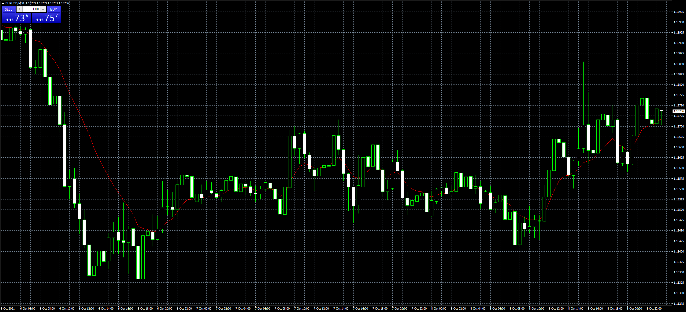

# Bryant_Adaptive_Moving_Average

> Source: https://fxcodebase.com/code/viewtopic.php?f=38&t=71559  
> Forum: 38 · Topic 71559 · 2 post(s)

---

## Bryant_Adaptive_Moving_Average

**Apprentice** · Sun Oct 10, 2021 4:06 am

TS2 Version.
[https://fxcodebase.com/code/viewtopic.p ... 62#p143862](https://fxcodebase.com/code/viewtopic.php?f=17&p=143862#p143862)

 [Bryant_Adaptive_Moving_Average.mq4](files/143904/Bryant_Adaptive_Moving_Average.mq4)

---

## Re: Bryant_Adaptive_Moving_Average

**Val_20** · Mon Oct 11, 2021 2:51 pm

Thank you!
