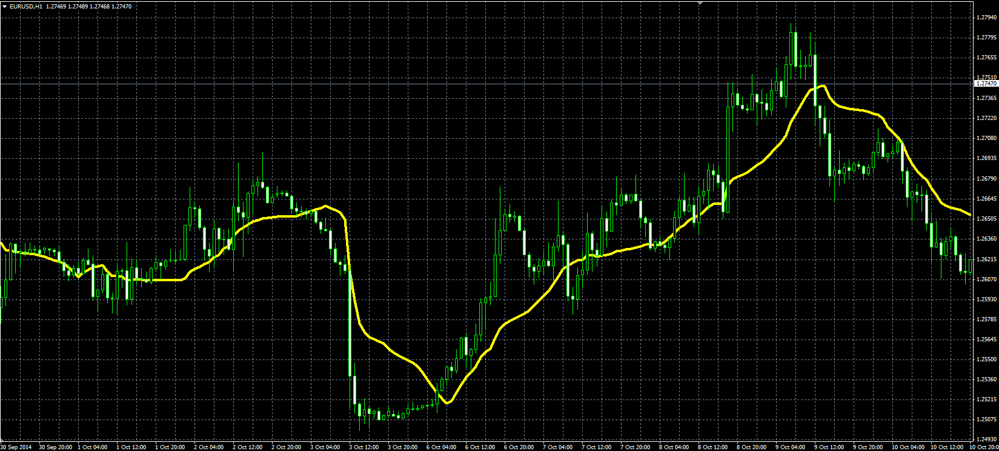

# Buff Average

> Source: https://fxcodebase.com/code/viewtopic.php?f=38&t=61456  
> Forum: 38 · Topic 61456 · 1 post(s)

---

## Buff Average

**Alexander.Gettinger** · Mon Nov 17, 2014 5:23 pm

Original LUA indicator: [viewtopic.php?f=17&t=22436](https://fxcodebase.com/code/viewtopic.php?f=17&t=22436).

Formula:
Buff = AvgVC/AvgVol, where
AvgVC = MVA(VC) with [Length] number of periods,
AvgVol = MVA(Volume) with [Length] number of periods,
VC = Volume*Close.

 

Download:

 [Buff.mq4](files/97130/Buff.mq4)
