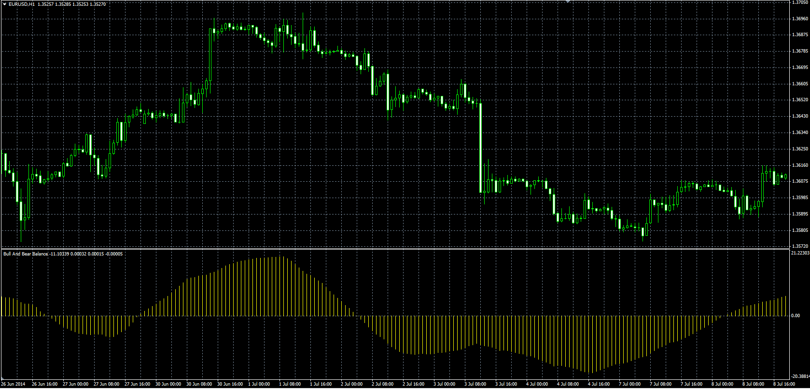

# Bull And Bear Balance Indicator

> Source: https://fxcodebase.com/code/viewtopic.php?f=38&t=61059  
> Forum: 38 · Topic 61059 · 1 post(s)

---

## Bull And Bear Balance Indicator

**Alexander.Gettinger** · Wed Aug 20, 2014 10:05 am

Original LUA oscillator: [viewtopic.php?f=17&t=60072](https://fxcodebase.com/code/viewtopic.php?f=17&t=60072).

Formula:
BBB = MA(MA_Bull-MA_Bear, Smooth_Method, Smooth_Length), where
MA_Bull = MA(Bull_Power, Method, Length),
MA_Bear = MA(Bear_Power, Method, Length),
MA(Source, Method, Length) - moving average with [Method] as Type and [Length] as number of periods.

 

Download:

 [BBB.mq4](files/95446/BBB.mq4)
