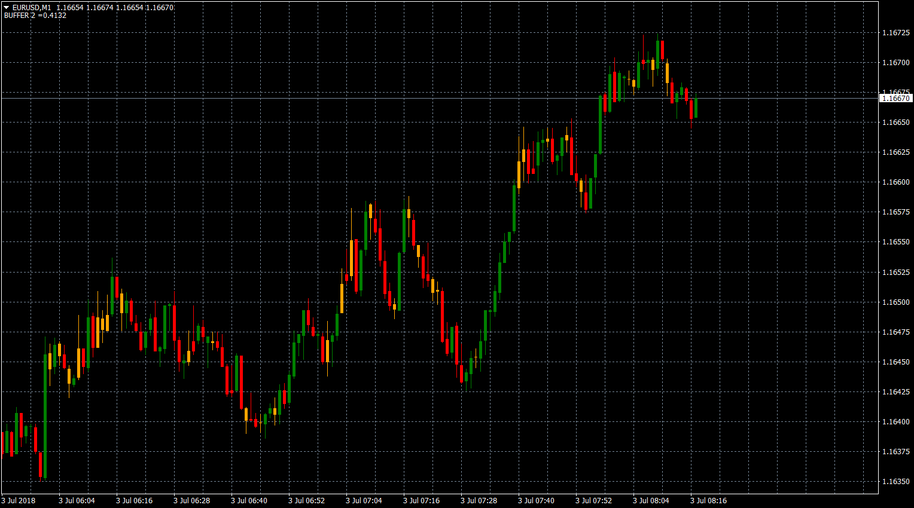

# Bull Bear Bar

> Source: https://fxcodebase.com/code/viewtopic.php?f=38&t=66240  
> Forum: 38 · Topic 66240 · 1 post(s)

---

## Bull Bear Bar

**Apprentice** · Tue Jul 03, 2018 5:16 am

TS2 / Lua version.
[viewtopic.php?f=17&t=63211](https://fxcodebase.com/code/viewtopic.php?f=17&t=63211)

Indicator paint a bar after it closes within a specified area of the bar's range,
based on the following options:
1. Close within the top 1/4 of the bar's range.
2. Close within the top 1/3 of bar.
3. Close within the mid 1/3 of bar.
4. Close within the bottom 1/3 of bar.
5. Close within the bottom 1/4 of bar.

 [Bull Bear Bar.mq4](files/119789/Bull%20Bear%20Bar.mq4)
