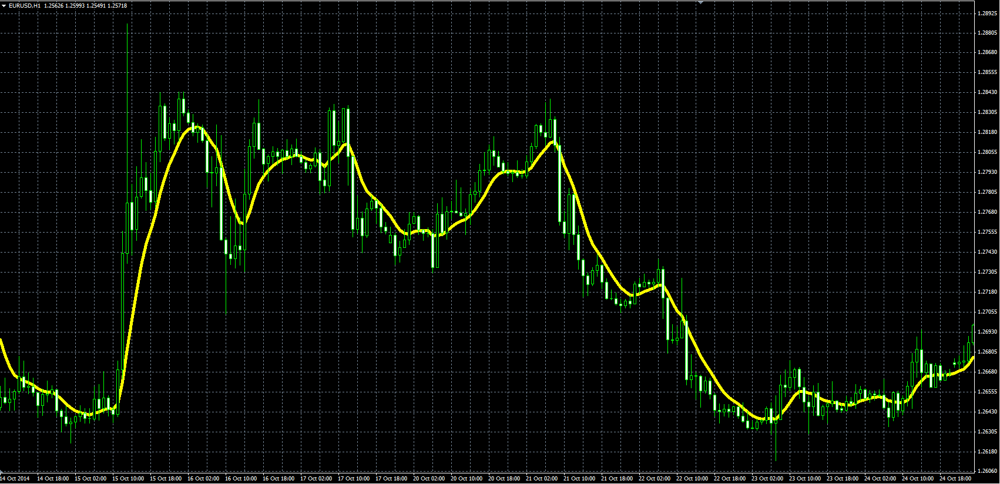

# Butterworth Moving Average

> Source: https://fxcodebase.com/code/viewtopic.php?f=38&t=61505  
> Forum: 38 · Topic 61505 · 1 post(s)

---

## Butterworth Moving Average

**Alexander.Gettinger** · Thu Nov 20, 2014 6:03 pm

Indicator is a moving average with smoothing Butterworth filter.

Formulas:
ButtMA[i] = p1*Price + p2*BattMA[i-1] - p3*BattMA[i-2], where
p1 = 2/(1+Length),
p2 = 2*(1-Kf),
p3 = (1-Kf)*(1-Kf),
Kf = sqrt(p1),
sqrt - square root.

 

Download:

 [ButtMA.mq4](files/97244/ButtMA.mq4)
