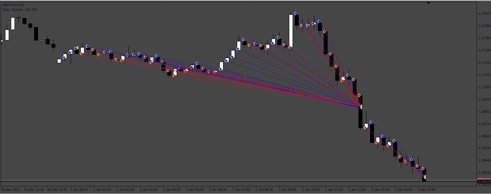
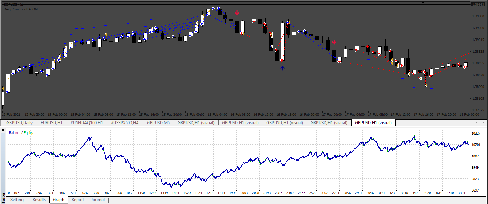

# Buy_Sell_By_Color_Candle EA

> Source: https://fxcodebase.com/code/viewtopic.php?f=38&t=74761  
> Forum: 38 · Topic 74761 · 10 post(s)

---

## Buy_Sell_By_Color_Candle EA

**Apprentice** · Mon Apr 08, 2024 3:43 am

Based on the request.
[https://fxcodebase.com/code/viewtopic.php?f=38&t=74758](https://fxcodebase.com/code/viewtopic.php?f=38&t=74758)

 [Buy_Sell_By_Color_CandleEA.mq4](files/154954/Buy_Sell_By_Color_CandleEA.mq4)

---

## Re: Buy_Sell_By_Color_Candle EA

**Appu264** · Mon Apr 08, 2024 4:17 am

SIR PLEASE ADD TSL IN THIS EA

---

## Re: Buy_Sell_By_Color_Candle EA

**inver61** · Sat Apr 13, 2024 1:59 pm

Hello apprentice, would it be possible to apply a filter to this EA, with the following indicator "SuperTrend averages 2.6"? The operation would be the same (I would buy in each candle), but the filter would act as follows: if the indicator is long (bullish), I would only buy all bullish candles and on the other hand, if the indicator is short (bearish), only I would buy the bearish candles. Super Trend would act as a filter.
Thank you so much

---

## Re: Buy_Sell_By_Color_Candle EA

**Apprentice** · Sun Apr 14, 2024 10:59 am

We have added your request to the development list.
Development reference 301

---

## Re: Buy_Sell_By_Color_Candle EA

**Appu264** · Fri Apr 26, 2024 1:11 am

Hello apprentice, would it be possible to apply a filter to this EA, with the following indicator "Indicador_TV_to_MT4"? The operation would be the same (I would buy in each candle), but the filter would act as follows: if the indicator is long (bullish), I would only buy all bullish candles and on the other hand, if the indicator is short (bearish), only I would buy the bearish candles. Indicador_TV_to_MT4.mq4 would act as a filter.
Thank you so much

---

## Re: Buy_Sell_By_Color_Candle EA

**Apprentice** · Sat Apr 27, 2024 2:22 am

We have added your request to the development list.
Development reference 334

---

## Re: Buy_Sell_By_Color_Candle EA

**Apprentice** · Mon Apr 29, 2024 10:25 am

 [Indicador_TV_to_MT4.mq4](files/155189/Indicador_TV_to_MT4.mq4)

 [Buy_Sell_By_Color_CandleEA_filterByIndicatorTV.mq4](files/155189/Buy_Sell_By_Color_CandleEA_filterByIndicatorTV.mq4)

---

## Re: Buy_Sell_By_Color_Candle EA

**kenny22** · Fri May 03, 2024 12:01 pm

Sir, please see what's going on?

---

## Re: Buy_Sell_By_Color_Candle EA

**Apprentice** · Fri May 10, 2024 10:20 am

[Buy_Sell_By_Color_CandleEA.mq4](files/155314/Buy_Sell_By_Color_CandleEA.mq4)

 [Buy_Sell_By_Color_CandleEA_filterByIndicatorTV.mq4](files/155314/Buy_Sell_By_Color_CandleEA_filterByIndicatorTV.mq4)

---

## Re: Buy_Sell_By_Color_Candle EA

**Apprentice** · Wed May 15, 2024 3:06 pm

Task 301
[https://fxcodebase.com/code/viewtopic.php?f=38&t=74870](https://fxcodebase.com/code/viewtopic.php?f=38&t=74870)
