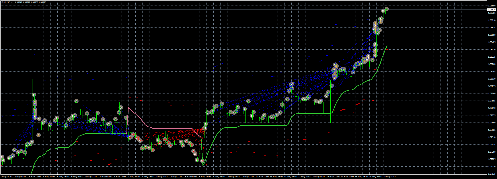
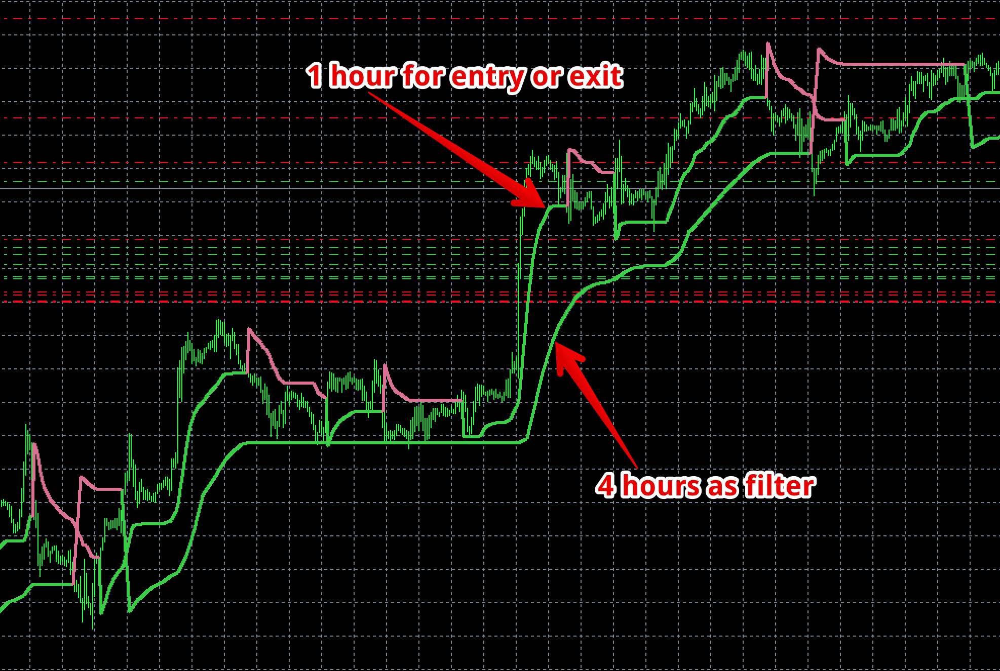

# Buy_Sell_By_Color_Candle_with_Supertrend_EA

> Source: https://fxcodebase.com/code/viewtopic.php?f=38&t=74870  
> Forum: 38 · Topic 74870 · 15 post(s)

---

## Buy_Sell_By_Color_Candle_with_Supertrend_EA

**Apprentice** · Wed May 15, 2024 3:04 pm

Based on the request.
[https://fxcodebase.com/code/viewtopic.p ... 00#p155000](https://fxcodebase.com/code/viewtopic.php?f=38&p=155000#p155000)

 [SuperTrend averages 2.6.ex4](files/155347/SuperTrend%20averages%202.6.ex4)

 [Buy_Sell_By_Color_Candle_with_Supertrend_EA_v1.00.mq4](files/155347/Buy_Sell_By_Color_Candle_with_Supertrend_EA_v1.00.mq4)

---

## Re: Buy_Sell_By_Color_Candle_with_Supertrend_EA

**Satya264** · Fri May 17, 2024 3:36 am

MAKE A INDICATOR AND EA AS MTF
 TRADE PER NEW CANDLE
Up Trend to buy per candle or Down Trend to sell per candle
lot size tp sl and tsl customized
Close all trade when the Trend is changed its automatically
 ACCOUNT protector For account equity
CLOSE BY MONEY TRUE AND FALSE

here is indicator and EA ATTACHMENT

---

## Re: Buy_Sell_By_Color_Candle_with_Supertrend_EA

**Apprentice** · Fri May 17, 2024 4:14 pm

We have added your request to the development list.
Development reference 384

---

## Re: Buy_Sell_By_Color_Candle_with_Supertrend_EA

**inver61** · Sat May 18, 2024 12:27 pm

> **Apprentice wrote:**
>
>
> eurusd-h1-fxcm-australia-pty.png
>
>
> Based on the request.
> [https://fxcodebase.com/code/viewtopic.p ... 00#p155000](https://fxcodebase.com/code/viewtopic.php?f=38&p=155000#p155000)
>
>
> SuperTrend averages 2.6.ex4
>
>
>
>
> Buy_Sell_By_Color_Candle_with_Supertrend_EA_v1.00.mq4

OK, thanks a lot.

---

## Re: Buy_Sell_By_Color_Candle_with_Supertrend_EA

**trtrader** · Mon May 20, 2024 7:59 am

could you please create a quick version of this ea Buy_Sell_By_Color_Candle_with_Supertrend_EA_v1.00.mq4 that will:

- only open 1 order when the super trend changes colour and don't open new orders until supter trend changes colour?

- have ratio rate profit.
- RSI take profit when RSI cross 70 from top to down and 30 from down to up.
- Trailing stop that will move automatically when the super trend line becomes horizontal.

---

## Re: Buy_Sell_By_Color_Candle_with_Supertrend_EA

**Apprentice** · Wed May 22, 2024 1:52 pm

We have added your request to the development list.
Development reference 418

---

## Re: Buy_Sell_By_Color_Candle_with_Supertrend_EA

**trtrader** · Mon May 27, 2024 4:37 pm

Hi,

In addition to the changes above, Could you please also add a higher time frame as a filter to lower time frame signals? (This option is already in the indicator settings)

And nother option for the opposite signal close. if true, exit by higher time frame colour change.

 

---

## Re: Buy_Sell_By_Color_Candle_with_Supertrend_EA

**Apprentice** · Wed May 29, 2024 9:45 am

[Buy_Sell_By_Color_Candle_with_Supertrend_EA_v1.10.mq4](files/155562/Buy_Sell_By_Color_Candle_with_Supertrend_EA_v1.10.mq4)

Try this version.

---

## Re: Buy_Sell_By_Color_Candle_with_Supertrend_EA

**trtrader** · Sun Jun 23, 2024 6:36 pm

thank you, could you also please add the same indicator as filter with timeframe options?

---

## Re: Buy_Sell_By_Color_Candle_with_Supertrend_EA

**Apprentice** · Tue Jul 02, 2024 3:54 pm

We have added your request to the development list.
Development reference 545

---

## Re: Buy_Sell_By_Color_Candle_with_Supertrend_EA

**Apprentice** · Mon Jul 08, 2024 1:55 pm

[Buy_Sell_By_Color_Candle_with_Supertrend_EA_v1.20.mq4](files/156055/Buy_Sell_By_Color_Candle_with_Supertrend_EA_v1.20.mq4)

Try this version.

---

## Re: Buy_Sell_By_Color_Candle_with_Supertrend_EA

**trtrader** · Tue Jul 30, 2024 9:18 pm

Could you please add work days and hours?

---

## Re: Buy_Sell_By_Color_Candle_with_Supertrend_EA

**Apprentice** · Wed Jul 31, 2024 3:21 pm

We have added your request to the development list.
Development reference 617

---

## Re: Buy_Sell_By_Color_Candle_with_Supertrend_EA

**Apprentice** · Tue Aug 06, 2024 3:26 pm

[Buy_Sell_By_Color_Candle_with_Supertrend_EA_v1.30.mq4](files/156339/Buy_Sell_By_Color_Candle_with_Supertrend_EA_v1.30.mq4)

Try this version.

---

## Re: Buy_Sell_By_Color_Candle_with_Supertrend_EA

**Apprentice** · Mon Jan 20, 2025 11:00 am

Task 384

 [Indicador_TV_to_MT4.mq4](files/157914/Indicador_TV_to_MT4.mq4)

 [Indicator_TV_to_MT4_EA.mq4](files/157914/Indicator_TV_to_MT4_EA.mq4)
