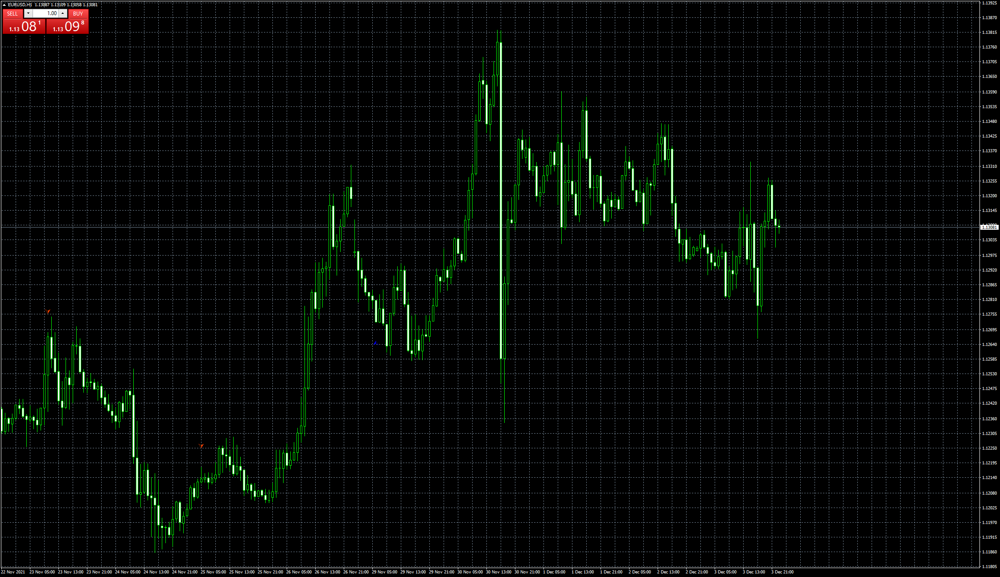
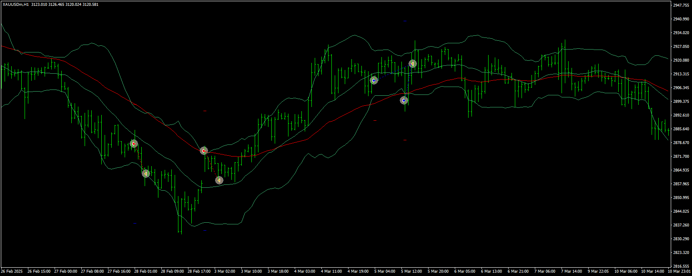

# Buy Sell Indicator EA

> Source: https://fxcodebase.com/code/viewtopic.php?f=38&t=71693  
> Forum: 38 · Topic 71693 · 7 post(s)

---

## Buy Sell Indicator EA

**Apprentice** · Sat Dec 04, 2021 2:30 am

Based on the request.
[https://fxcodebase.com/code/viewtopic.php?f=38&t=71646](https://fxcodebase.com/code/viewtopic.php?f=38&t=71646)

 [Buy Sell Indicator.mq4](files/144412/Buy%20Sell%20Indicator.mq4)

 [Buy Sell Indicator EA.mq4](files/144412/Buy%20Sell%20Indicator%20EA.mq4)

---

## Re: Buy Sell Indicator EA

**Momomi** · Fri Mar 04, 2022 3:06 am

Hi, Apprentice

Since it's working well for me, can I request for this to have a Martingale option?
- Adjustable starting lot size
- Adjustable multiplier

Thank you

---

## Re: Buy Sell Indicator EA

**Apprentice** · Fri Mar 04, 2022 11:58 am

Your request is added to the development list.
Development reference 137.

---

## Re: Buy Sell Indicator EA

**Momomi** · Thu Mar 24, 2022 11:41 pm

Hi Apprentice,

I came across a Martingale EA you developed posted on another post.
Alright, before you proceed with the above request, I would like to clarify the Martingale style:

- Entry is based on the indicator
- Adjustable starting lot size
- Adjustable multiplier
- Adjustable gap between orders
- Adjustable Take Profit distance
- Close all positions once PriceTarget is met

Now PriceTarget is actually the AveragePrice of all the positions opened by the Martingale + TakeProfit distance set by the user.

In Summary:
PriceTarget = AveragePrice + TakeProfit

So, as more positions are opened & accordingly to the multiplier set, the TP value changes because the AveragePrice changes. AveragePrice is like the 'Point Zero' for all the open trades (by the EA) or 'Break Even' aka $0.00. TakeProfit is our profit and this is in Pips.

So, how much $$ profit we make is dependent on the biggest lot size opened plus the TP pips.

---

## Re: Buy Sell Indicator EA

**Momomi** · Fri Mar 25, 2022 12:00 am

Here is an example of how I would like for the Martingale to work.

The Blue line is the AveragePrice; if price were to go to that point, the $$ of our trade is $0.00.
TP is a fixed distance that we set and this is based on the AveragePrice calculation.

For this case, say if price goes up again and another position is opened (based on my multiplier, next lot is 1.38), then AveragePrice is now higher. Likewise for the TP, it will go higher because it just follows AveragePrice.

This TP is set for all the opened positions; the same for all the positions opened by the EA.
Meaning, the positions 0.37 and below (in the picture) will close with losses BUT the overall trade is still profitable because of the bigger lot sizes above (Martingale).

I hope it is clearer now

---

## Re: Buy Sell Indicator EA

**Apprentice** · Thu Jan 30, 2025 5:27 am

Task 138

 [Buy_Sell_Dashboard.mq4](files/158063/Buy_Sell_Dashboard.mq4)

---

## Re: Buy Sell Indicator EA

**Apprentice** · Wed Jul 16, 2025 3:50 am

I would like to clarify the Martingale style:

Entry is based on the indicator

Adjustable starting lot size

Adjustable multiplier

Adjustable gap between orders

Adjustable Take Profit distance

Close all positions once PriceTarget is met

Now PriceTarget is actually the AveragePrice of all the positions opened by the Martingale + TakeProfit distance set by the user.

In Summary:
PriceTarget = AveragePrice + TakeProfit

So, as more positions are opened & accordingly to the multiplier set, the TP value changes because the AveragePrice changes. AveragePrice is like the 'Point Zero' for all the open trades (by the EA) or 'Break Even' aka $0.00. TakeProfit is our profit and this is in Pips.

So, how much $$ profit we make is dependent on the biggest lot size opened plus the TP pips.

 [Buy_Sell__Indicator_EA.mq4](files/159938/Buy_Sell__Indicator_EA.mq4)
