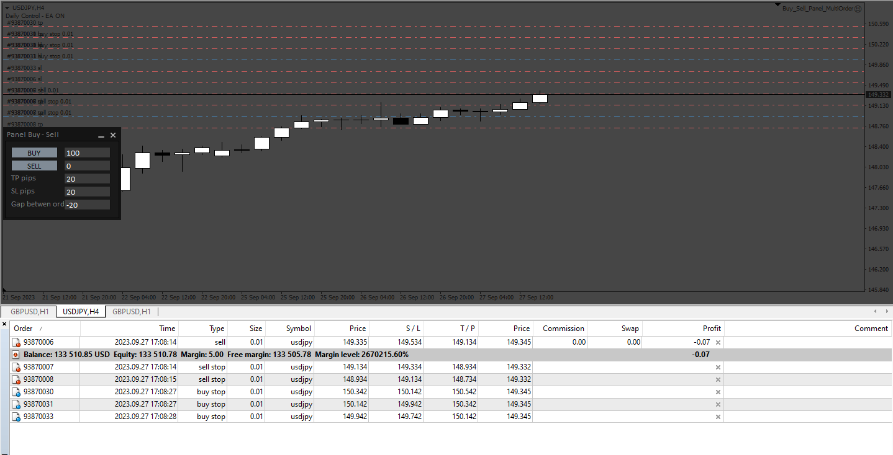
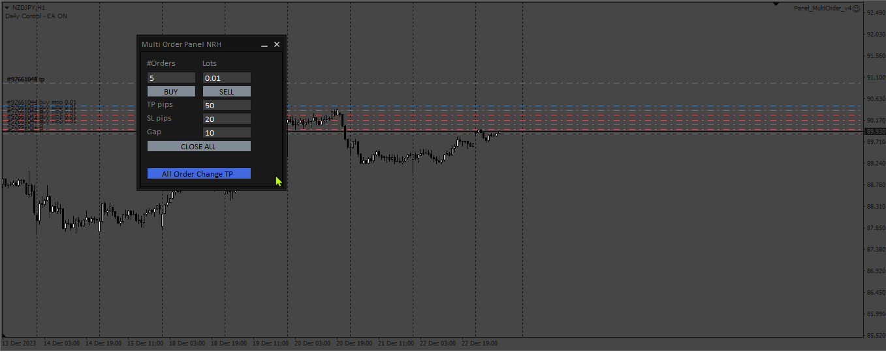
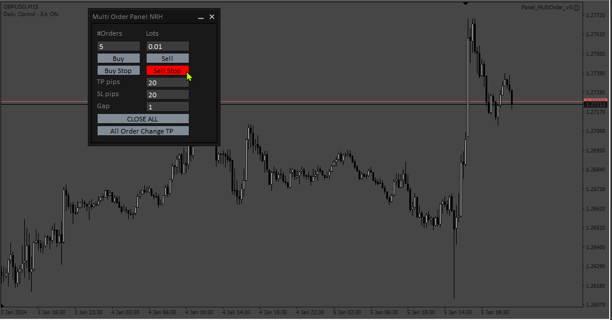
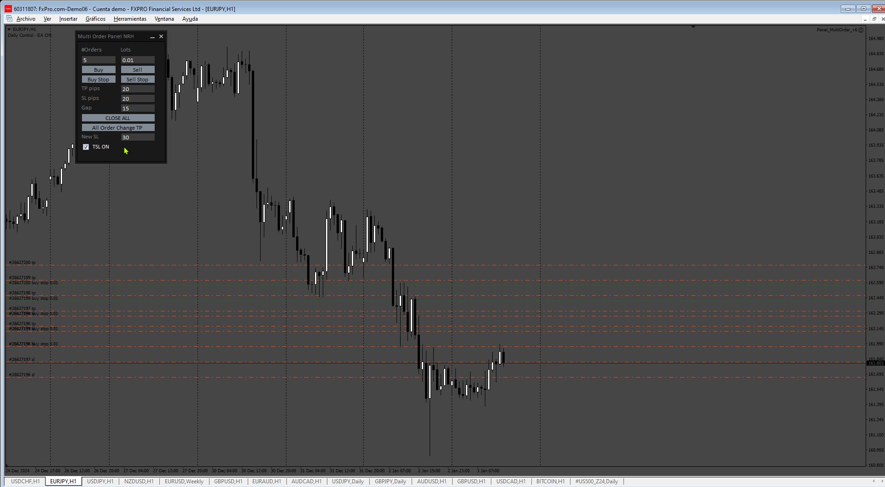

# Buy_Sell_Panel_MultiOrder

> Source: https://fxcodebase.com/code/viewtopic.php?f=38&t=74218  
> Forum: 38 · Topic 74218 · 9 post(s)

---

## Buy_Sell_Panel_MultiOrder

**Apprentice** · Mon Oct 02, 2023 3:13 pm

Based on the request.
[https://fxcodebase.com/code/viewtopic.php?f=27&p=152674](https://fxcodebase.com/code/viewtopic.php?f=27&p=152674)

 [Buy_Sell_Panel_MultiOrder.mq4](files/152795/Buy_Sell_Panel_MultiOrder.mq4)

---

## Re: Buy_Sell_Panel_MultiOrder

**Apprentice** · Thu Dec 28, 2023 5:21 am

 [Panel_MultiOrder_v4.mq4](files/153826/Panel_MultiOrder_v4.mq4)

---

## Re: Buy_Sell_Panel_MultiOrder

**Appu264** · Thu Dec 28, 2023 11:59 pm

please change buy button to buy
sell button to sell
add two more button sell stop and buy stop

---

## Re: Buy_Sell_Panel_MultiOrder

**Apprentice** · Tue Jan 02, 2024 12:52 pm

We have added your request to the development list.
Development reference 15

---

## Re: Buy_Sell_Panel_MultiOrder

**Apprentice** · Sat Jan 06, 2024 2:30 am

 [Panel_MultiOrder_v5.mq4](files/153933/Panel_MultiOrder_v5.mq4)

---

## Re: Buy_Sell_Panel_MultiOrder

**Apprentice** · Fri Dec 13, 2024 3:29 pm

Based on the request.
[https://fxcodebase.com/code/viewtopic.p ... 28#p157428](https://fxcodebase.com/code/viewtopic.php?f=27&t=75396&p=157428#p157428)

 [Panel_MultiOrder_v6.mq4](files/157528/Panel_MultiOrder_v6.mq4)

---

## Re: Buy_Sell_Panel_MultiOrder

**VuxxLong** · Wed Dec 18, 2024 11:17 pm

Hi Apprentice, please include a textbox for new stoploss points and a checkbox for the active trailing stop. and convert to mq5, tks.

---

## Re: Buy_Sell_Panel_MultiOrder

**Apprentice** · Mon Dec 30, 2024 8:12 pm

We have added your request to the development list.
Development reference 945

---

## Re: Buy_Sell_Panel_MultiOrder

**Apprentice** · Mon Jan 06, 2025 4:59 pm

 

 [Panel_Multiorder_MT5.mq5](files/157730/Panel_Multiorder_MT5.mq5)

 [Panel_MultiOrder_v7.mq4](files/157730/Panel_MultiOrder_v7.mq4)
