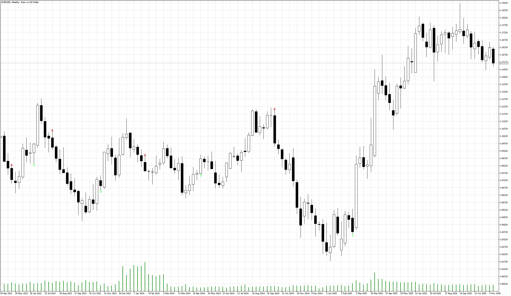

# Buy_Sell_Signals_Only

> Source: https://fxcodebase.com/code/viewtopic.php?f=38&t=76448  
> Forum: 38 · Topic 76448 · 4 post(s)

---

## Buy_Sell_Signals_Only

**Apprentice** · Sat Nov 22, 2025 3:50 pm

Based on the request.
[https://fxcodebase.com/code/viewtopic.p ... 17#p161117](https://fxcodebase.com/code/viewtopic.php?f=27&p=161117#p161117)

 [Buy_Sell_Signals_Only.mq5](files/161268/Buy_Sell_Signals_Only.mq5)

---

## Re: Buy_Sell_Signals_Only

**Stellar** · Thu Nov 27, 2025 4:52 am

Hi, Thank you for your hardwork, but can you help me to make sendnotifications once arrow appear on the chart please... Thank youuu

---

## Re: Buy_Sell_Signals_Only

**Apprentice** · Sat Nov 29, 2025 11:44 am

We have added your request to the development list.
Development reference 752

---

## Re: Buy_Sell_Signals_Only

**Apprentice** · Wed Dec 31, 2025 10:40 am

[Buy_Sell_Signals_Only_v2.mq5](files/161474/Buy_Sell_Signals_Only_v2.mq5)
