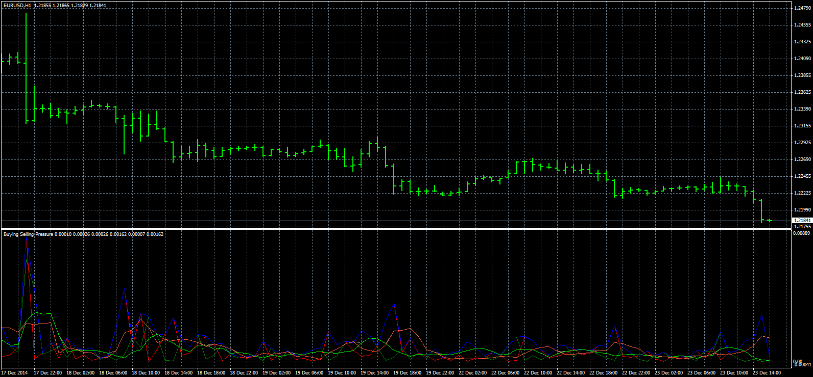

# Buying/Selling Pressure

> Source: https://fxcodebase.com/code/viewtopic.php?f=38&t=62404  
> Forum: 38 · Topic 62404 · 1 post(s)

---

## Buying/Selling Pressure

**Apprentice** · Mon Jul 06, 2015 9:48 am

Based on
[viewtopic.php?f=17&t=32052](https://fxcodebase.com/code/viewtopic.php?f=17&t=32052)

BP = high-open
SP = open -low

Prevailing pressure filter
If BP > SP then
PP = BP
If SP > BP then
PP = SP

Type 1 Filter
0 - Both
1 - Buying
2 - Selling
3- Prevailing

Type 2 Filter
0 - Both
1 - Unsmoothed
2 -Smoothed

 [BSP.mq4](files/101300/BSP.mq4)
