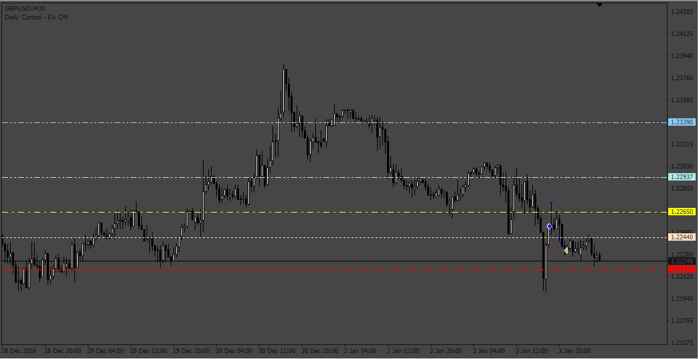
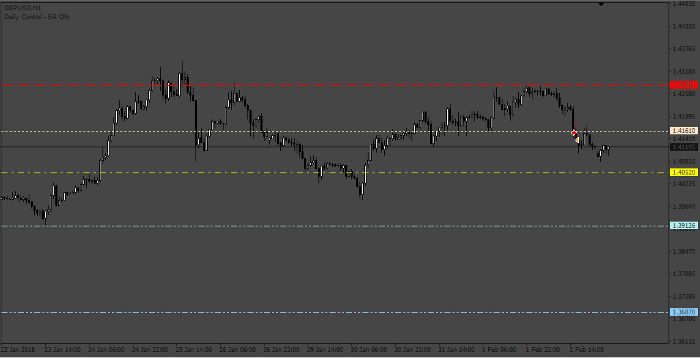

# BuySell_EA

> Source: https://fxcodebase.com/code/viewtopic.php?f=38&t=73265  
> Forum: 38 · Topic 73265 · 8 post(s)

---

## BuySell_EA

**Apprentice** · Mon Jan 23, 2023 10:38 am

Based on the request.
[https://fxcodebase.com/code/viewtopic.php?f=27&p=149169](https://fxcodebase.com/code/viewtopic.php?f=27&p=149169)

 [BuySel Alert - Indicator.mq4](files/149255/BuySel%20Alert%20-%20Indicator.mq4)

 [BuySell_EA.mq4](files/149255/BuySell_EA.mq4)

---

## Re: BuySell_EA

**Sensible** · Thu Jan 26, 2023 4:33 am

Hello Apprentice and Team of FxcodeBase,

I really appreciate the Job done and effort to put this BuySell EA together. I am grateful.

I have few issues with it.

First after installating it to Mt4 platform and to put it to take a trade on Demo account it prompted me with popup alert to: Please, Install the BuySel Alert-indicator.ex4 indicator

and again when I run it on Strategy Tester it not taking any trade.

Secondly, In the Input parameter setting this are missing from BreakEven and Tight Trailing Stops:

-Breakeven with Steps( it very important to be include)

-TrailingAct

-TrailingStep

 Thanks looking forward to these corrections.

---

## Re: BuySell_EA

**Apprentice** · Thu Jan 26, 2023 5:43 am

We have added your request to the development list.
Development reference 85.

---

## Re: BuySell_EA

**Apprentice** · Wed Feb 01, 2023 2:04 pm

Try it now.

---

## Re: BuySell_EA

**Sensible** · Fri Feb 03, 2023 3:26 am

Hello Apprentice and Team of FxcodeBase,

I really appreciate the Job done and effort putting to make this BuySell EA to work. I am grateful.

Thanks for solving my first issue of prompting me with popup alert to: Please, Install the BuySel Alert-indicator.ex4 indicator: it has being fixed and the Second issue in the Input parameter setting that are missing from BreakEven - Breakeven with Steps( it very important to be include)and Tight Trailing Stops -TrailingAct and -TrailingStep: I can see that it all be included.

My remaining issue that is yet to be fix is that: failed to take a trade when tested it on strategy tester.

When I run the EA on Strategy Tester it not taking any trade but when I drag and drop the indicator of BuySel_indicator into the strategy tester together with the EA the BuySel_indicator is giving me signal which I observer on Journal but the EA is not initiating open trade.

And again the indicator line showing startline and targetline were blinking on and off on chart of the strategy tester but when I stop the tester it show up.

Please Sir help me to fix it to initiate open trade.

---

## Re: BuySell_EA

**Sensible** · Sun Feb 05, 2023 8:15 pm

> **Sensible wrote:**
> Hello Apprentice and Team of FxcodeBase,
>
> My remaining issue that is yet to be fix is that: failed to take a trade when tested it on strategy tester.
>
> When I run the EA on Strategy Tester it not taking any trade but when I drag and drop the indicator of BuySel_indicator into the strategy tester together with the EA the BuySel_indicator is giving me signal which I observer on Journal but the EA is not initiating open trade.
>
> And again the indicator line showing startline and targetline were blinking on and off on chart of the strategy tester but when I stop the tester it show up.
>
> Please Sir help me to fix it to initiate open trade.

**Any update whether it has being fixed.**

---

## Re: BuySell_EA

**Apprentice** · Wed Feb 08, 2023 8:37 am

We have added your request to the development list.
Development reference 137.

---

## Re: BuySell_EA

**Apprentice** · Fri Feb 10, 2023 8:04 am

