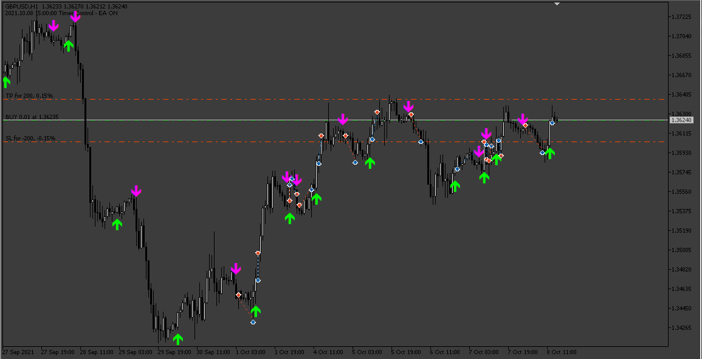
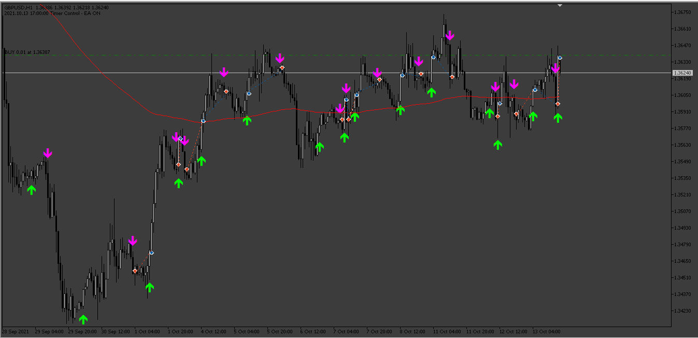

# BykovTrend_EA

> Source: https://fxcodebase.com/code/viewtopic.php?f=38&t=74682  
> Forum: 38 · Topic 74682 · 12 post(s)

---

## BykovTrend_EA

**Apprentice** · Mon Mar 11, 2024 2:17 pm

Based on the request.
[https://fxcodebase.com/code/viewtopic.php?f=38&t=74670](https://fxcodebase.com/code/viewtopic.php?f=38&t=74670)

 [BykovTrendAlert.mq5](files/154648/BykovTrendAlert.mq5)

 [BykovTrend_EA.mq5](files/154648/BykovTrend_EA.mq5)

---

## Re: BykovTrend_EA

**alizon** · Fri Mar 22, 2024 2:55 pm

Hello sir, Can you make Any filter?

1. Add Filter Mooving Average 200
2. Close On Opposite Signal

Thank You

---

## Re: BykovTrend_EA

**Apprentice** · Wed Mar 27, 2024 10:32 am

We have added your request to the development list.
Development reference 273

---

## Re: BykovTrend_EA

**Apprentice** · Sat Mar 30, 2024 5:17 pm

 [BykovTrend_EA_v2.mq5](files/154891/BykovTrend_EA_v2.mq5)

---

## Re: BykovTrend_EA

**Shadow_eg** · Sun Apr 21, 2024 11:28 pm

sir can make little changes:
1) when close on opposite signal open new trade by new signal. In this version ea close current trade when receive opposite signal and not open new signal
2) can make close all trades on account when will reach X profit in $ or % for basket trading

---

## Re: BykovTrend_EA

**Apprentice** · Mon Apr 22, 2024 10:43 am

We have added your request to the development list.
Development reference 319

---

## Re: BykovTrend_EA

**Apprentice** · Tue May 28, 2024 1:26 pm

[BykovTrend_EA_v3.mq5](files/155542/BykovTrend_EA_v3.mq5)

Try this version.

---

## Re: BykovTrend_EA-MTF Filter

**[email protected]** · Mon Sep 16, 2024 5:31 pm

> **Apprentice wrote:**
>
>
> BykovTrend_EA_v3.mq5
>
>
> Try this version.

Hi. Please add a multi-timeframe (MTF) filter to this EA.
For example, in order to open a buy position, in addition to changing the direction of the indicator in the lower time frame, a buy signal must have already been issued in the higher time frame.
 In order to open a sell position, in addition to changing the direction of the indicator in the lower time frame, a sell signal must have already been issued in the higher time frame.
Choosing a higher time frame filter as an option is determined by the trader (Inputs), for example M15. M30, H1, H4 and ...

Thanks in advance.

---

## Re: BykovTrend_EA

**Apprentice** · Wed Sep 18, 2024 4:05 pm

We have added your request to the development list.
Development reference 727

---

## Re: BykovTrend_EA

**trtrader** · Thu Sep 19, 2024 4:19 pm

Could you please add this as filter and provide a mt4 version?

---

## Re: BykovTrend_EA

**Apprentice** · Mon Sep 23, 2024 2:23 pm

Can you please define the filter?

---

## Re: BykovTrend_EA

**Apprentice** · Fri Sep 27, 2024 6:34 am

Task 727
Try this version.

 [BykovTrend_EA_v4.mq5](files/156807/BykovTrend_EA_v4.mq5)
