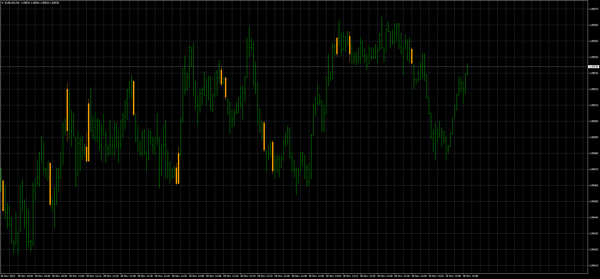

# C3 Bar

> Source: https://fxcodebase.com/code/viewtopic.php?f=38&t=74378  
> Forum: 38 · Topic 74378 · 7 post(s)

---

## C3 Bar

**Apprentice** · Tue Nov 28, 2023 7:18 am

Based on the request.
[https://fxcodebase.com/code/viewtopic.php?f=17&t=74340](https://fxcodebase.com/code/viewtopic.php?f=17&t=74340)

 [C3bar.mq4](files/153432/C3bar.mq4)

TS2 version.
[https://fxcodebase.com/code/viewtopic.php?f=17&t=74411](https://fxcodebase.com/code/viewtopic.php?f=17&t=74411)

---

## Re: C3 Bar

**Stomp2k** · Tue Nov 28, 2023 7:51 am

It appears to be painting the bar3 of the confirmed pattern, can this be revised to paint the previous bar, bar2, of the confirmed 3bar pattern. Otherwise awesome work as always.

---

## Re: C3 Bar

**Apprentice** · Tue Nov 28, 2023 9:19 am

Task 1038

---

## Re: C3 Bar

**gudutrader** · Tue Nov 28, 2023 12:56 pm

> **Apprentice wrote:**
>
>
> eurusd-m1-fxcm-australia-pty.png
>
>
> Based on the request.
> [https://fxcodebase.com/code/viewtopic.php?f=17&t=74340](https://fxcodebase.com/code/viewtopic.php?f=17&t=74340)
>
>
> C3bar.mq4

Hi, is possible to convert to .lua file.
thks

---

## Re: C3 Bar

**Apprentice** · Tue Dec 05, 2023 7:29 am

We have added your request to the development list.
Development reference 1083

---

## Re: C3 Bar

**Apprentice** · Tue Dec 05, 2023 8:30 am

TS2 version.
[https://fxcodebase.com/code/viewtopic.php?f=17&t=74411](https://fxcodebase.com/code/viewtopic.php?f=17&t=74411)

---

## Re: C3 Bar

**Apprentice** · Thu Dec 07, 2023 2:55 pm

Try this version.

 [C3bar_v.1.10.mq4](files/153607/C3bar_v.1.10.mq4)
