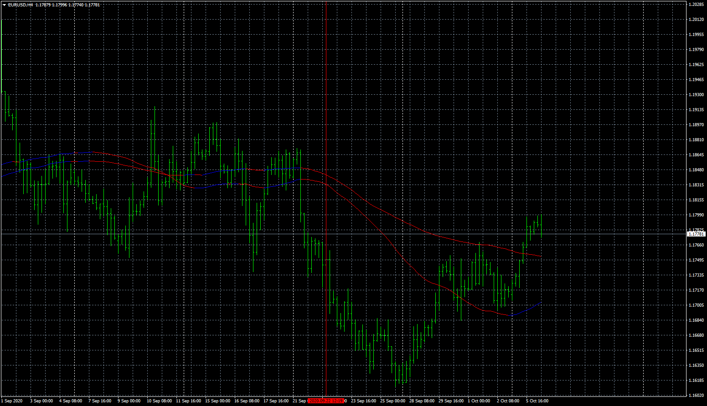

# CA_-_MA_cross

> Source: https://fxcodebase.com/code/viewtopic.php?f=38&t=70513  
> Forum: 38 · Topic 70513 · 4 post(s)

---

## CA_-_MA_cross

**Apprentice** · Tue Oct 06, 2020 2:59 am

Based on request.
[viewtopic.php?f=27&t=2296&start=20](https://fxcodebase.com/code/viewtopic.php?f=27&t=2296&start=20)

 [CA_-_MA_cross.mq4](files/138099/CA_-_MA_cross.mq4)

---

## Re: CA_-_MA_cross

**Jjoetong** · Sat Oct 10, 2020 12:10 pm

Thank You for the indicator. Could you please program an EA that runs with it? Below I've attached a video of how it should work and where the take profits and stop losses should be set at. Much appreciated!

[https://www.youtube.com/watch?v=BLUs-E- ... egyTesting](https://www.youtube.com/watch?v=BLUs-E-wUQ0&ab_channel=TradingStrategyTesting)

---

## Re: CA_-_MA_cross

**Apprentice** · Sun Oct 11, 2020 4:20 am

Your request is added to the development list.
Development reference 2167.

---

## Re: CA_-_MA_cross

**Apprentice** · Mon Oct 12, 2020 2:24 am

Try this version.
[viewtopic.php?f=38&t=70529&p=138209#p138209](https://fxcodebase.com/code/viewtopic.php?f=38&t=70529&p=138209#p138209)
