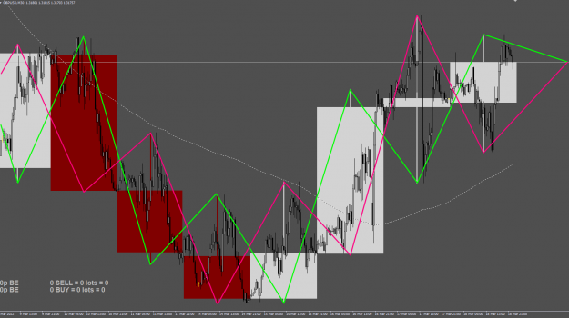
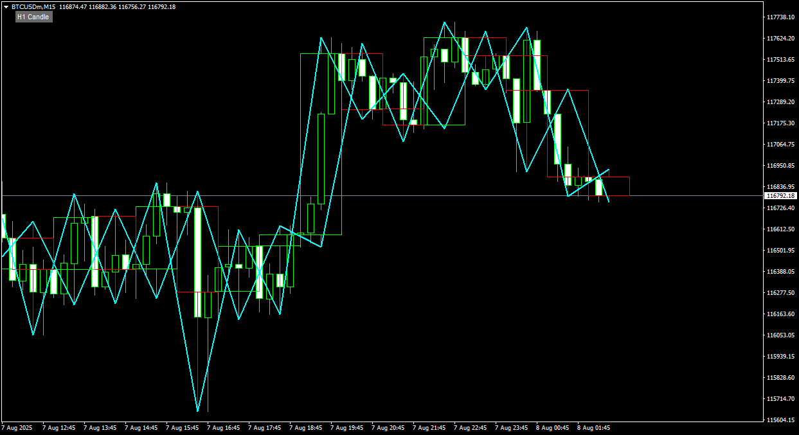

# can you convert M-Candles into MT5

> Source: https://fxcodebase.com/code/viewtopic.php?f=38&t=76175  
> Forum: 38 · Topic 76175 · 6 post(s)

---

## can you convert M-Candles into MT5

**whyhui** · Tue Jul 22, 2025 8:29 am

can you convert M-Candles into MT5

 [M-Candles button.mq4](files/159990/M-Candles%20button.mq4)

---

## Re: can you convert M-Candles into MT5

**Apprentice** · Wed Jul 23, 2025 4:03 am

We have added your request to the development list.
Development reference 476

---

## Re: can you convert M-Candles into MT5

**Apprentice** · Mon Jul 28, 2025 4:19 am

Try this version.
[https://fxcodebase.com/code/viewtopic.p ... 56#p160056](https://fxcodebase.com/code/viewtopic.php?f=38&t=76193&p=160056#p160056)

---

## Re: can you convert M-Candles into MT5

**marcelo2k9** · Sun Aug 03, 2025 10:16 am

Please can you make an mt4 version of this indicator ? It's the same m candle but the HH is connected to LL of the next candle stick and the other way round just like in the picture, thank you so much

 

---

## Re: can you convert M-Candles into MT5

**Apprentice** · Mon Aug 04, 2025 4:28 am

We have added your request to the development list.
Development reference 491

---

## Re: can you convert M-Candles into MT5

**Apprentice** · Mon Aug 11, 2025 4:14 am

 [M-Candles_button.mq4](files/160212/M-Candles_button.mq4)
