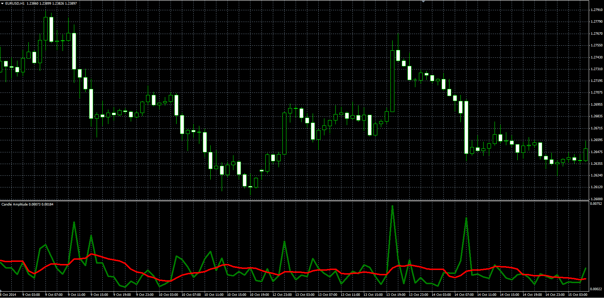

# Candle amplitude oscillator

> Source: https://fxcodebase.com/code/viewtopic.php?f=38&t=61523  
> Forum: 38 · Topic 61523 · 1 post(s)

---

## Candle amplitude oscillator

**Alexander.Gettinger** · Fri Nov 21, 2014 5:22 pm

The indicator has 2 modes:
1. show High-Low
2. show Close-Open.

In addition indicator draws average value as a signal line.

 

Download:

 [Candle_Amplitude.mq4](files/97298/Candle_Amplitude.mq4)
