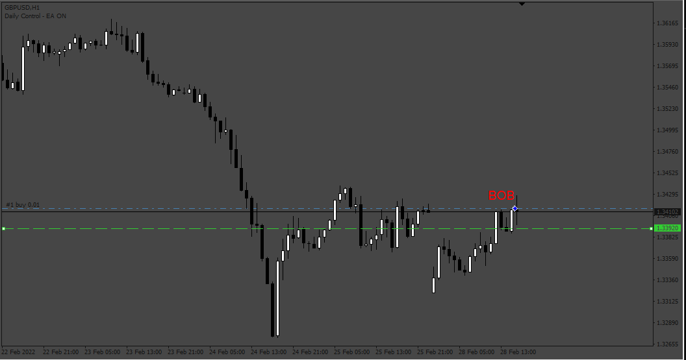
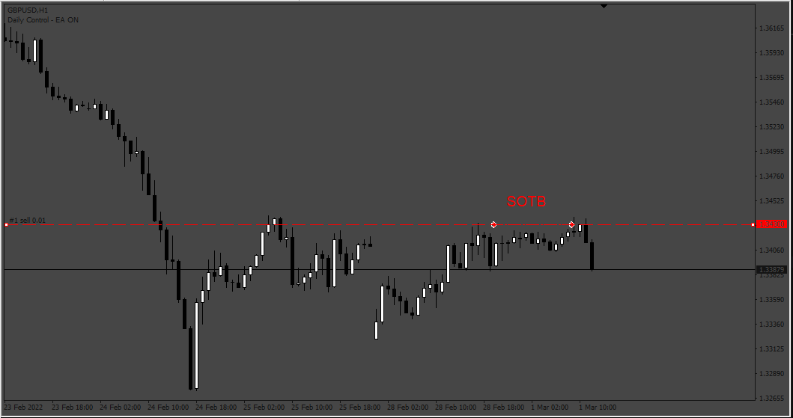

# Candle_Close_EA

> Source: https://fxcodebase.com/code/viewtopic.php?f=38&t=74556  
> Forum: 38 · Topic 74556 · 3 post(s)

---

## Candle_Close_EA

**Apprentice** · Mon Jan 22, 2024 8:08 am

 

Based on the request.
[https://fxcodebase.com/code/viewtopic.php?f=27&p=153408](https://fxcodebase.com/code/viewtopic.php?f=27&p=153408)

 [Candle_Close_EA.mq4](files/154151/Candle_Close_EA.mq4)

---

## Re: Candle_Close_EA

**rajeshram** · Mon Sep 02, 2024 6:17 am

Hi Apprentice, Thank you very much. I tested this indicator and just one request please. Currently the EA is taking unlimited trades as long as conditions are satisfied (for example, Sell of false break SOFB. It takes multiple trades if there is more than one false break at a specified price).

Is it possible for the Trader to limit the number of trades taken by the EA . For example Trader should be able to specify Count of Total positions , Buy position limit and Sells limit.

This way, if the Trader specifies only 2 trades , then EA after taking 2 trades must not trade further unless already taken trades are closed.

Thank you again.

---

## Re: Candle_Close_EA

**rajeshram** · Mon Sep 02, 2024 7:35 am

Hi Apprentice, Sorry all good. The EA works well as there is control switch to limit number of orders taken and it works well. Sorry again please delete my previous post. All good, thank you again.
