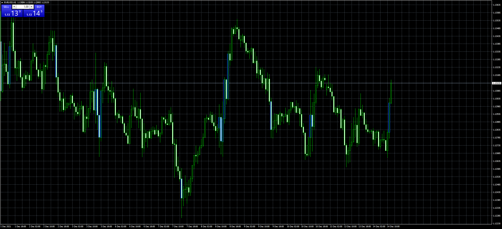

# candle_color_change_indicator

> Source: https://fxcodebase.com/code/viewtopic.php?f=38&t=71709  
> Forum: 38 · Topic 71709 · 1 post(s)

---

## candle_color_change_indicator

**Apprentice** · Tue Dec 14, 2021 5:39 am

Based on the request.
[https://fxcodebase.com/code/viewtopic.php?f=55&t=70146](https://fxcodebase.com/code/viewtopic.php?f=55&t=70146)
indicator that change the only the candles color if it moves for example X pips or more

 [candle_color_change_indicator.mq4](files/144468/candle_color_change_indicator.mq4)
