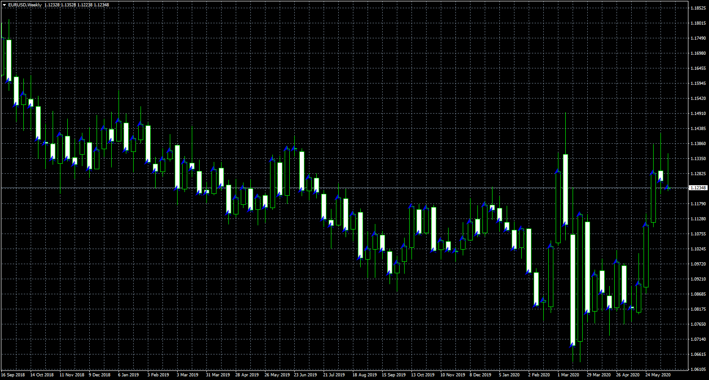

# Candle Direction Predictor

> Source: https://fxcodebase.com/code/viewtopic.php?f=38&t=70031  
> Forum: 38 · Topic 70031 · 5 post(s)

---

## Candle Direction Predictor

**Apprentice** · Wed Jun 17, 2020 6:49 am

TS2/Lua version.
[viewtopic.php?f=17&t=64201](https://fxcodebase.com/code/viewtopic.php?f=17&t=64201)

 [Candle Direction Predictor.mq4](files/135031/Candle%20Direction%20Predictor.mq4)

 [Candle Direction Predictor.mq5](files/135031/Candle%20Direction%20Predictor.mq5)

 [Historical Candle Direction Predictor.mq4](files/135031/Historical%20Candle%20Direction%20Predictor.mq4)

 [Historical Candle Direction Predictor.mq5](files/135031/Historical%20Candle%20Direction%20Predictor.mq5)

---

## Re: Candle Direction Predictor

**giova90** · Wed Oct 14, 2020 6:27 am

This indicator (both mt4 and mt5) doesn't show arrow on the current candle, like it shows in the first thread: [viewtopic.php?f=17&t=64201](https://fxcodebase.com/code/viewtopic.php?f=17&t=64201)

...nor percentage. Is it possible to make it show the arrow on current candle and percentage, or I have misunderstood something?

---

## Re: Candle Direction Predictor

**giova90** · Wed Oct 14, 2020 6:41 am

PS. Also it is very slow to charge when changing parameters in the settings, is it possible to make it faster?

---

## Re: Candle Direction Predictor

**Apprentice** · Mon Oct 19, 2020 3:26 am

Your request is added to the development list.
Development reference 2199.

---

## Re: Candle Direction Predictor

**Apprentice** · Mon Dec 28, 2020 3:25 pm

[Candle Direction Predictor.mq4](files/139839/Candle%20Direction%20Predictor.mq4)

 [Candle Direction Predictor.mq5](files/139839/Candle%20Direction%20Predictor.mq5)

Try this versions.
