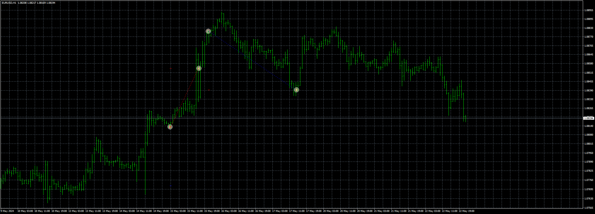

# Candle_EA

> Source: https://fxcodebase.com/code/viewtopic.php?f=38&t=74895  
> Forum: 38 · Topic 74895 · 4 post(s)

---

## Candle_EA

**Apprentice** · Wed May 22, 2024 2:43 pm

Based on the request.
[https://fxcodebase.com/code/viewtopic.php?f=27&p=155225](https://fxcodebase.com/code/viewtopic.php?f=27&p=155225)

 [Candle_EA_v1.00.mq4](files/155457/Candle_EA_v1.00.mq4)

---

## Re: Candle_EA

**ZeroMenthol** · Tue May 28, 2024 11:15 am

thank you!

there are some refinement needed though.

here's a video that will explain full details on the strategy. thanks in advance!

[https://www.youtube.com/watch?v=Ht7LITID0mA&t=16s](https://www.youtube.com/watch?v=Ht7LITID0mA&t=16s)

---

## Re: Candle_EA

**Apprentice** · Sun Jun 02, 2024 2:45 pm

We have added your request to the development list.
Development reference 463

---

## Re: Candle_EA

**Apprentice** · Thu Mar 06, 2025 3:59 pm

I have created the exact formula from the video. If you need any further refinements, please describe them precisely.

 [Candle_EA_v1.10.mq4](files/158518/Candle_EA_v1.10.mq4)
