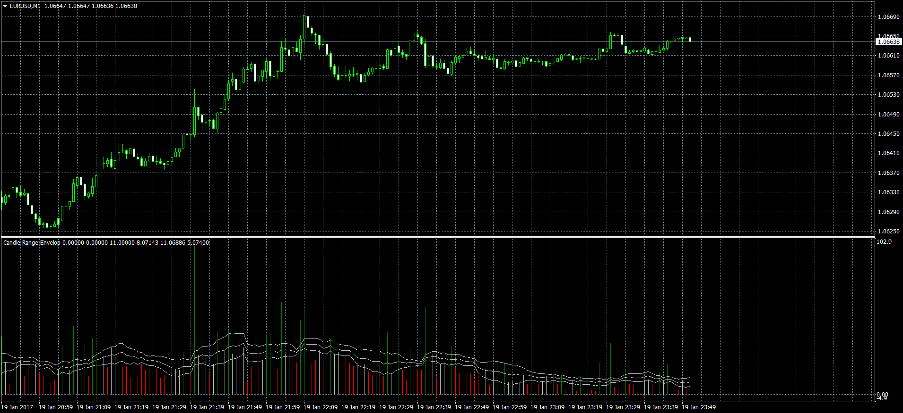

# Candle Range Envelop

> Source: https://fxcodebase.com/code/viewtopic.php?f=38&t=64316  
> Forum: 38 · Topic 64316 · 1 post(s)

---

## Candle Range Envelop

**Apprentice** · Thu Jan 19, 2017 5:41 pm

Based on TS2 / Marketscope / Lua script
[viewtopic.php?f=17&t=61561](https://fxcodebase.com/code/viewtopic.php?f=17&t=61561)
Candle Range will give Candle length, candle range in Pips.
You can choose between High / Low or Open / Close.

 [Candle Range Envelop.mq4](files/110603/Candle%20Range%20Envelop.mq4)
