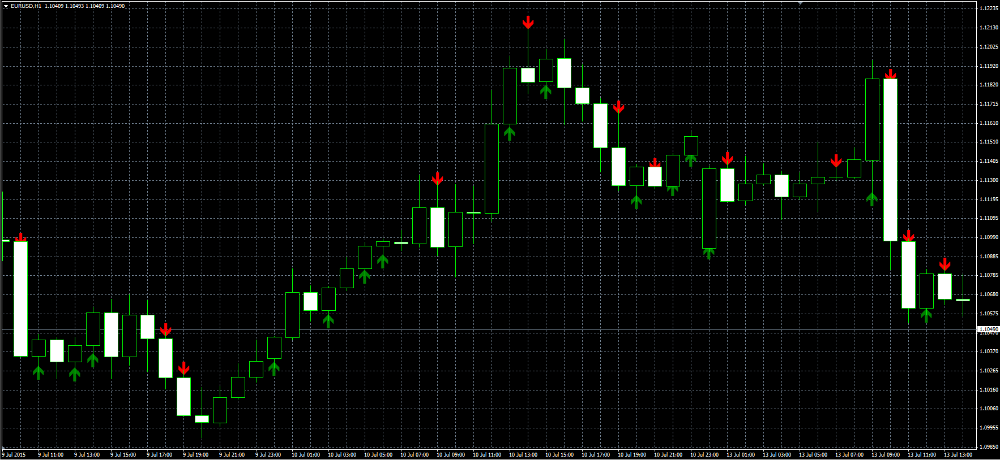

# Candle Range

> Source: https://fxcodebase.com/code/viewtopic.php?f=38&t=62483  
> Forum: 38 · Topic 62483 · 3 post(s)

---

## Candle Range

**Alexander.Gettinger** · Wed Jul 29, 2015 7:31 am

Original LUA indicator: [viewtopic.php?f=17&t=62316](http://www.fxcodebase.com/code/viewtopic.php?f=17&t=62316).

> Will draw arrow, if closing price is within the top / bottom X percentage of candles.

 

Download:

 [CandleRange.mq4](files/101588/CandleRange.mq4)

---

## Re: Candle Range

**jkmcbrine** · Fri Feb 03, 2017 5:50 pm

Looking for a candle ea, one that takes into consideration the next candle after a trigger?

---

## Re: Candle Range

**Apprentice** · Mon Feb 06, 2017 4:37 am

Can you please describe your strategy.

Open Long if...
Open Short ...
...
