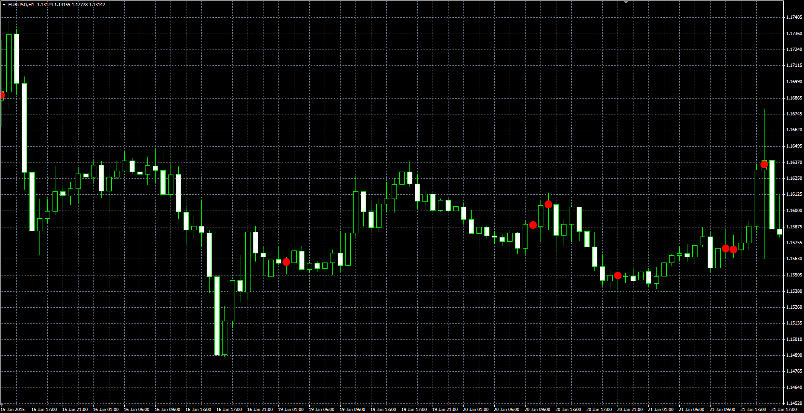

# Candle Range

> Source: https://fxcodebase.com/code/viewtopic.php?f=38&t=61861  
> Forum: 38 · Topic 61861 · 1 post(s)

---

## Candle Range

**Alexander.Gettinger** · Mon Feb 23, 2015 11:29 am

Original LUA indicator: [viewtopic.php?f=17&t=61656](https://fxcodebase.com/code/viewtopic.php?f=17&t=61656).

The indicator shows dot if Range>=Level. Range = 100*Abs(Open-Close)/(High-Low),
Abs - Absolute value.

 

Download:

 [Candle_Range.mq4](files/98812/Candle_Range.mq4)
