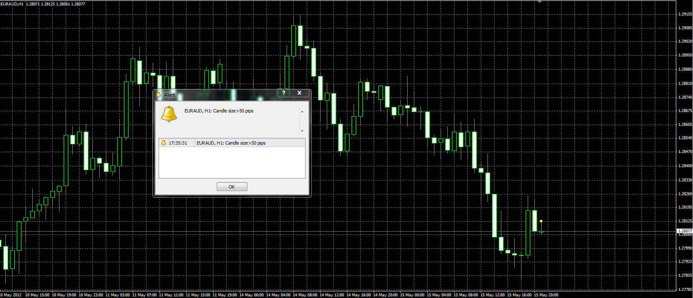

# Candle size alert

> Source: https://fxcodebase.com/code/viewtopic.php?f=38&t=18350  
> Forum: 38 · Topic 18350 · 1 post(s)

---

## Candle size alert

**Alexander.Gettinger** · Tue May 15, 2012 4:33 pm

The indicator highlights the candles which (High-Low) is greater than [LevelSize] and can show alert on last candle.

 

Download:

 [Candle_Size_Alert.mq4](files/33043/Candle_Size_Alert.mq4)
