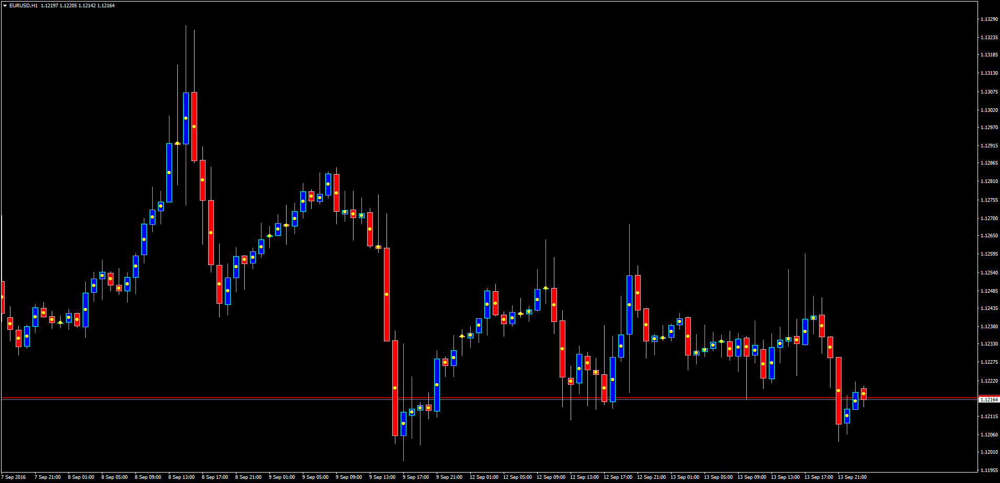

# CandleMidPoint

> Source: https://fxcodebase.com/code/viewtopic.php?f=38&t=63868  
> Forum: 38 · Topic 63868 · 1 post(s)

---

## CandleMidPoint

**Apprentice** · Wed Sep 14, 2016 11:44 am

TS2/Marketscope Version.
[viewtopic.php?f=17&t=63850](https://fxcodebase.com/code/viewtopic.php?f=17&t=63850)

The indicator plots the mid value from the High to the Low of each Candle;
or the mid value of the distance between the Open and Close
 (Body of the Candle).

The user can select from a list of different MT4 arrows and change the color.

 [CandleMidPoint.mq4](files/108094/CandleMidPoint.mq4)
