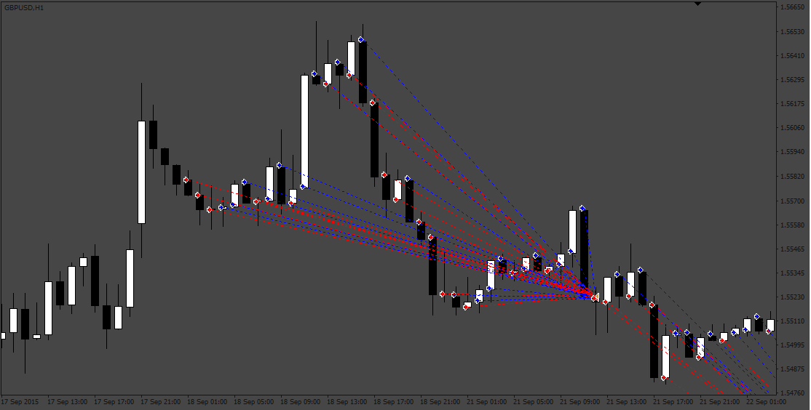
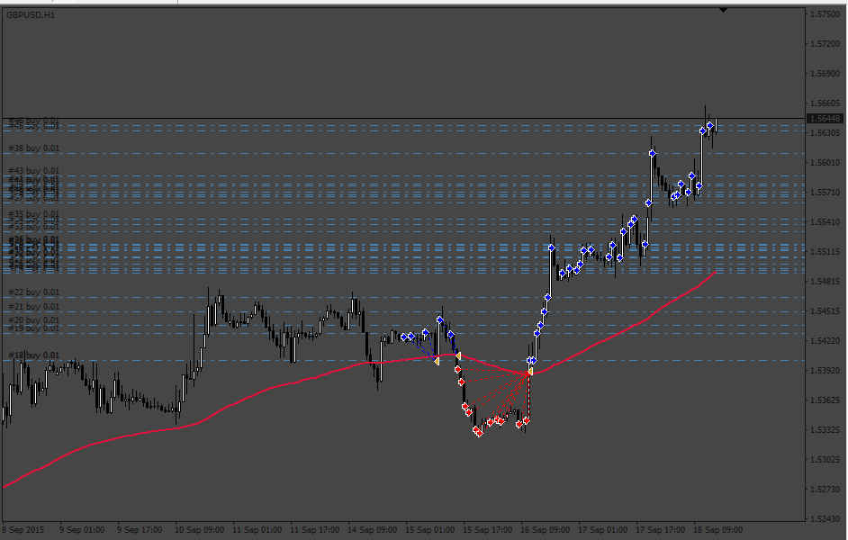

# Candles EA

> Source: https://fxcodebase.com/code/viewtopic.php?f=38&t=71990  
> Forum: 38 · Topic 71990 · 11 post(s)

---

## Candles EA

**Apprentice** · Tue Mar 22, 2022 10:53 am

Based on the request.
[https://fxcodebase.com/code/viewtopic.php?f=27&p=145384](https://fxcodebase.com/code/viewtopic.php?f=27&p=145384)

 [Candles EA.mq4](files/145404/Candles%20EA.mq4)

---

## Re: Candles EA

**blackworldpremium** · Wed Mar 23, 2022 3:18 am

hi admin
just for improvement

hope you can add moving average to filter entry.

if price above moving average just open buy position
if price below moving average just open sell position

hope can add also close all position when price touch moving average

thanks admin for hard work

---

## Re: Candles EA

**Apprentice** · Mon Mar 28, 2022 2:26 am

Your request is added to the development list.
Development reference 188.

---

## Re: Candles EA

**Apprentice** · Tue Mar 29, 2022 7:31 am

 [CandlesEAv2.mq4](files/145466/CandlesEAv2.mq4)

---

## Re: Candles EA

**blackworldpremium** · Tue Mar 29, 2022 3:02 pm

thanks admin for ur hardwork

last one can you add maximum number of entry like how many buy and sell it can entry.

thanks

---

## Re: Candles EA

**Apprentice** · Fri Apr 01, 2022 2:59 am

Your request is added to the development list.
Development reference 195.

---

## Re: Candles EA

**Apprentice** · Mon Apr 04, 2022 2:13 pm

[CandlesEAv2.mq4](files/145552/CandlesEAv2.mq4)

Try this version.

---

## Re: Candles EA

**blackworldpremium** · Tue Apr 12, 2022 5:08 pm

thanks admin really appreciate that

---

## Re: Candles EA

**AanIsnaini** · Thu May 12, 2022 10:49 am

Dear Mr. Apprentice,
is it possible to improve this EA, by strategic as below:
- Use Moving Averages filter: False
- EA is just running without take profit & stop loss. (Take profit on: False and Stop Loss on: False)
- The orders are just closed by the opposite signal.
- If the trade was closed with loss, then lot size is multiples (parameterized).

looking forward to have your miracle touch.

Thank you

---

## Re: Candles EA

**Apprentice** · Sat May 14, 2022 11:32 am

We have added your request to the development list.
Development reference 295.

---

## Re: Candles EA

**Apprentice** · Thu Sep 01, 2022 2:26 am

[CandlesEAv3.mq4](files/147313/CandlesEAv3.mq4)

Try this version.
