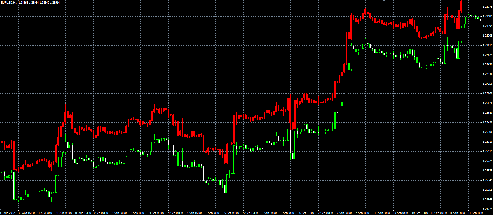

# Candles library

> Source: https://fxcodebase.com/code/viewtopic.php?f=38&t=23331  
> Forum: 38 · Topic 23331 · 1 post(s)

---

## Candles library

**Alexander.Gettinger** · Wed Sep 12, 2012 12:16 pm

Library provides user to draw the bars in the main or separate charts.

Before using the library must be placed in the directory /experts/include of MT4.
To connect the library, use the command "#include <Candles.mqh>" in indicator/EA.
The library contains the following functions:

**int CandleDraw(int _Window, datetime _Time, double _Open, double _High, double _Low, double _Close, color _Color, int _Width=3)**
Draw a candle with the parameters (_Time, _Open, _High, _Low, _Close, _Color) in the window _Window.
_Width - width of candle body.

**int CandleDelete(int _Window, datetime _Time)**
Delete the candle with time _Time in window _Window.

**void CandlesDeleteAll(int _Window)**
Delete all candles in window _Window.

**bool IsCandle(int _Window, datetime _Time)**
The function returns true if candle with time _Time exists in the window _Window, otherwise false.

**int CandleGet(int _Window, datetime _Time, double& _Open, double& _High, double& _Low, double& _Close, color& _Color, int& _Width)**
The function returns parameters of candle (_Open, _High, _Low, _Close, _Color, _Width) for specified _Window and _Time.

**int CandleSet(int _Window, datetime _Time, int _index, double _value)**
The function sets the parameter from the specified _Window and _Time.
_index can be:
CANDLEPROP_CLOSE,
CANDLEPROP_OPEN,
CANDLEPROP_HIGH,
CANDLEPROP_LOW,
CANDLEPROP_COLOR,
CANDLEPROP_WIDTH.

Example of use:

```mql4
//+------------------------------------------------------------------+
//|                                                CandlesSample.mq4 |
//|                               Copyright © 2012, Gehtsoft USA LLC |
//|                                            http://fxcodebase.com |
//+------------------------------------------------------------------+
#property copyright "Copyright © 2012, Gehtsoft USA LLC"
#property link      "http://fxcodebase.com"

#include <Candles.mqh>

#property indicator_chart_window

extern int Shift=200;
extern int MaxBars=100;

double ShiftPip;

int init()
  {
   IndicatorShortName("Candles sample");
   ShiftPip=Shift*Point;
   return(0);
  }

int deinit()
  {
   CandlesDeleteAll(0);
   return(0);
  }

int start()
{
 if(Bars<=1) return(0);
 int ExtCountedBars=IndicatorCounted();
 if (ExtCountedBars<0) return(-1);
 int pos;
 int limit=Bars-2;
 double O, H, L, C;
 color Col;
 int W;
 if(ExtCountedBars>2) limit=Bars-ExtCountedBars-1;
 pos=MathMin(limit,MaxBars);
 while(pos>=0)
 {
   
   CandleDraw(0, Time[pos], Open[pos]+ShiftPip, High[pos]+ShiftPip, Low[pos]+ShiftPip, Close[pos]+ShiftPip, Yellow);
   CandleSet(0, Time[pos], CANDLEPROP_COLOR, Red);
   CandleSet(0, Time[pos], CANDLEPROP_WIDTH, 6);
   CandleGet(0, Time[pos], O, H, L, C, Col, W);
   Print(pos,": ",O,", ",H,", ",L,", ",C,", ",Col,", ",W);
   if (Open[pos]==Close[pos] && IsCandle(0, Time[pos])) CandleDelete(0, Time[pos]);
  pos--;
 } 
 return(0);
}
```

 



Download library:

 [Candles.mqh](files/40163/Candles.mqh)
