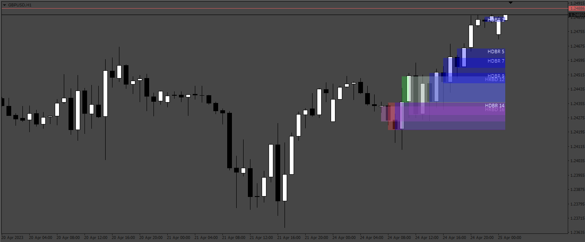
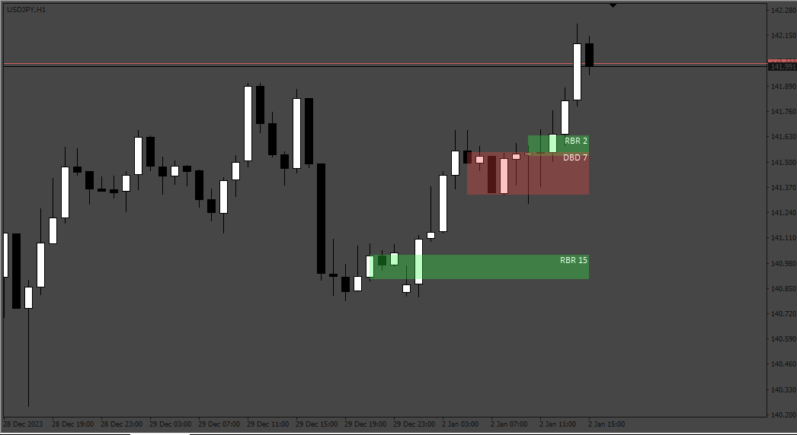
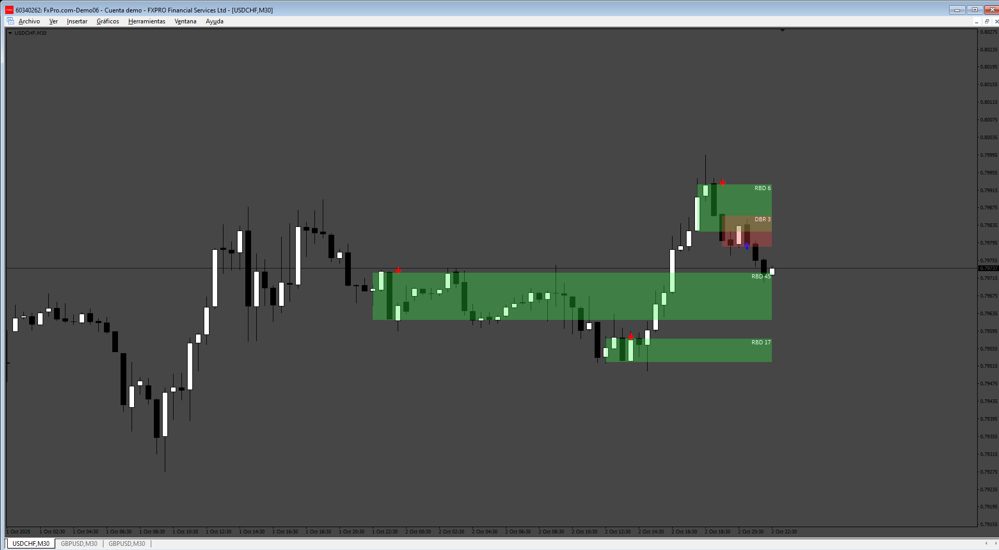

# Candles_Zones

> Source: https://fxcodebase.com/code/viewtopic.php?f=38&t=73660  
> Forum: 38 · Topic 73660 · 14 post(s)

---

## Candles_Zones

**Apprentice** · Mon May 01, 2023 3:28 am

Based on the request.
[https://fxcodebase.com/code/viewtopic.php?f=27&t=73581](https://fxcodebase.com/code/viewtopic.php?f=27&t=73581)

 [Candles_Zones.mq4](files/150625/Candles_Zones.mq4)

Lua version.
[https://fxcodebase.com/code/viewtopic.p ... 19#p160519](https://fxcodebase.com/code/viewtopic.php?f=17&t=76306&p=160519#p160519)

---

## Re: Candles_Zones

**portkinov** · Sat Jul 29, 2023 3:33 pm

Hi, can you make it lock timeframe as well? so it will not repaint when changing the timeframe.

Also add decsription that area with the timeframe choosen to be locked

---

## Re: Candles_Zones

**portkinov** · Mon Jul 31, 2023 5:29 pm

> **portkinov wrote:**
> Hi, can you make it lock timeframe as well? so it will not repaint when changing the timeframe.
>
> Also add decsription that area with the timeframe choosen to be locked

Also add this kind of pattern

RBR ( Rally Base Rally )
DBD ( Drop Base Drop )
RBD ( Rally Base Drop )
DBR ( Drop Base Rally )

---

## Re: Candles_Zones

**Apprentice** · Mon Jul 31, 2023 5:39 pm

We have added your request to the development list.
Development reference 655.

---

## Re: Candles_Zones

**portkinov** · Wed Aug 02, 2023 4:39 pm

> **Apprentice wrote:**
> We have added your request to the development list.
> Development reference 655.

Thanks!

---

## Re: Candles_Zones

**Apprentice** · Wed Jan 03, 2024 5:21 am

 [Candles_Zones_v2.mq4](files/153906/Candles_Zones_v2.mq4)

---

## Re: Candles_Zones

**ahmedalhosenyy** · Sun Feb 04, 2024 5:19 am

Nice indicator , Can we have in Lua ?

Thanks

---

## Re: Candles_Zones

**Apprentice** · Tue Feb 06, 2024 11:59 am

We have added your request to the development list.
Development reference 114

---

## Re: Candles_Zones

**ahmedalhosenyy** · Mon Mar 17, 2025 9:08 am

Any chance to have the .lua indicator

thanks

---

## Re: Candles_Zones

**ahmedalhosenyy** · Tue Aug 05, 2025 4:48 pm

Hello ,

Any updates ?

---

## Re: Candles_Zones

**Apprentice** · Thu Sep 11, 2025 12:53 pm

Lua version.
[https://fxcodebase.com/code/viewtopic.p ... 19#p160519](https://fxcodebase.com/code/viewtopic.php?f=17&t=76306&p=160519#p160519)

---

## Re: Candles_Zones

**khanatd** · Mon Sep 29, 2025 1:36 am

hi sir thanks, plz add arrows in mt4 version, thanks
khan

---

## Re: Candles_Zones

**Apprentice** · Wed Oct 01, 2025 6:14 am

We have added your request to the development list.
Development reference 619

---

## Re: Candles_Zones

**Apprentice** · Sat Oct 04, 2025 2:10 pm

 [Candles_Zones_v3.mq4](files/160758/Candles_Zones_v3.mq4)
