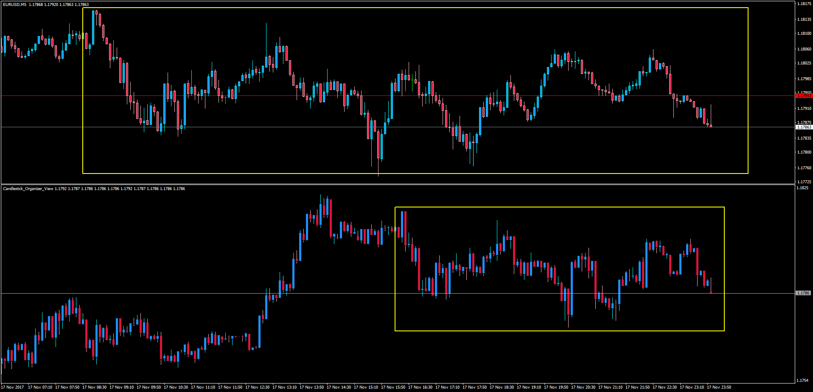

# Candlestick_Organizer_View

> Source: https://fxcodebase.com/code/viewtopic.php?f=38&t=65375  
> Forum: 38 · Topic 65375 · 1 post(s)

---

## Candlestick_Organizer_View

**Apprentice** · Sun Nov 19, 2017 4:05 pm

TS2/Lua version
[viewtopic.php?f=17&t=61101](https://fxcodebase.com/code/viewtopic.php?f=17&t=61101)
Description:
Doing this candlesticks organizer in MT4 was quite challenging. A replica of the chart candlesticks was made in a subwindow and then the "new chart" was generated following these rules:

If the current candlestick closes bearish, and the previous candle also closed bearish, the current one should be combined with the previous one > until a new bullish candle is formed and closes bullish. The same should be for bullish candlesticks.

The indicator can print the bullish/bearish bar right below the corresponding last bullish/bearish bar in the main chart or organize the presentation as a complete new chart.

 [Canclestick_Organizer_View.mq4](files/116106/Canclestick_Organizer_View.mq4)
