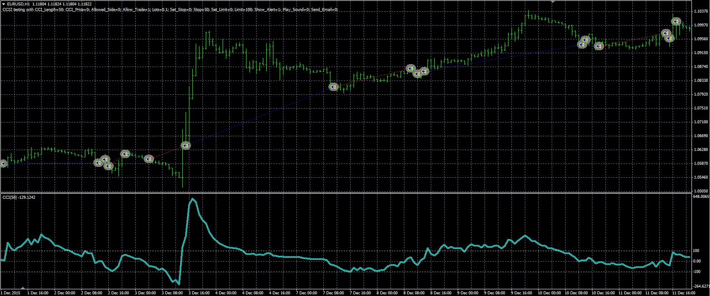

# CCI cross zero strategy

> Source: https://fxcodebase.com/code/viewtopic.php?f=38&t=63279  
> Forum: 38 · Topic 63279 · 1 post(s)

---

## CCI cross zero strategy

**Alexander.Gettinger** · Wed Mar 23, 2016 11:58 am

The strategy uses the SSI indicator.

Buy condition: CCI crosses over the zero line.
Sell condition: CCI crosses under the zero line.

 

Download:

 [CCIZ.mq4](files/105414/CCIZ.mq4)
