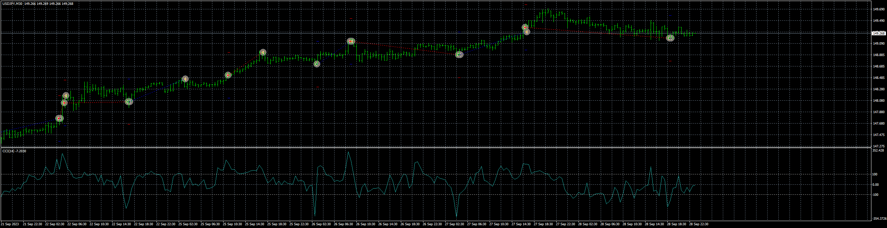

# CCI_EA

> Source: https://fxcodebase.com/code/viewtopic.php?f=38&t=74209  
> Forum: 38 · Topic 74209 · 5 post(s)

---

## CCI_EA

**Apprentice** · Thu Sep 28, 2023 3:31 pm

Based on the request.
[https://fxcodebase.com/code/viewtopic.php?f=38&t=74166](https://fxcodebase.com/code/viewtopic.php?f=38&t=74166)

 [CCI_EA_v1.00.mq4](files/152731/CCI_EA_v1.00.mq4)

---

## Re: CCI_EA

**swordfish304** · Sat Sep 30, 2023 10:13 am

Hi Apprentice,

Thanks a lot for this amazing EA.

There is some error in Martingale and Global Close.

1. Martingale - as per the attached picture, the red encircled with SL price of -6.30 the next TP price should be 18.90 and not 2.10 which means the martingale multiplication did not proceed.

2. Global close - I'm getting error when I choose equity percentage to close and stop EA for the day . Please check the attached picture.

And if possible can you include news filter.

Thanks again.

Regards,

swordfish

---

## Re: CCI_EA

**Apprentice** · Sun Oct 01, 2023 2:30 am

We have added your request to the development list.
Development reference 894.

---

## Re: CCI_EA

**Apprentice** · Tue Nov 21, 2023 7:28 am

[CCI_EA_v1.10.mq4](files/153344/CCI_EA_v1.10.mq4)

Try this version.

---

## Re: CCI_EA

**swordfish304** · Sat Nov 25, 2023 11:49 am

> **Apprentice wrote:**
>
>
> CCI_EA_v1.10.mq4
>
>
> Try this version.

Thanks a lot Apprentice.
