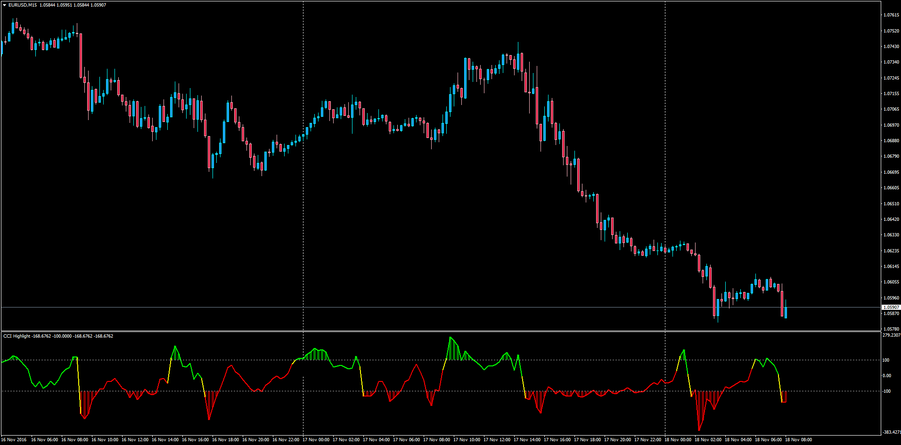

# CCI Highlight

> Source: https://fxcodebase.com/code/viewtopic.php?f=38&t=64112  
> Forum: 38 · Topic 64112 · 1 post(s)

---

## CCI Highlight

**Apprentice** · Fri Nov 18, 2016 12:18 pm

Description:
This is a colored CCI that will let the trader know when the CCI is above the Over Bought level and below the Over Sold level. Also, the CCI line will switch from green to red depending on whether is entering the OB/OS levels and keep that color until it goes to the opposite zone.

 [CCI_Highlight.mq4](files/109132/CCI_Highlight.mq4)

TS2/Marketscope version.
[viewtopic.php?f=17&t=62576&p=101946#p101946](https://fxcodebase.com/code/viewtopic.php?f=17&t=62576&p=101946#p101946)
