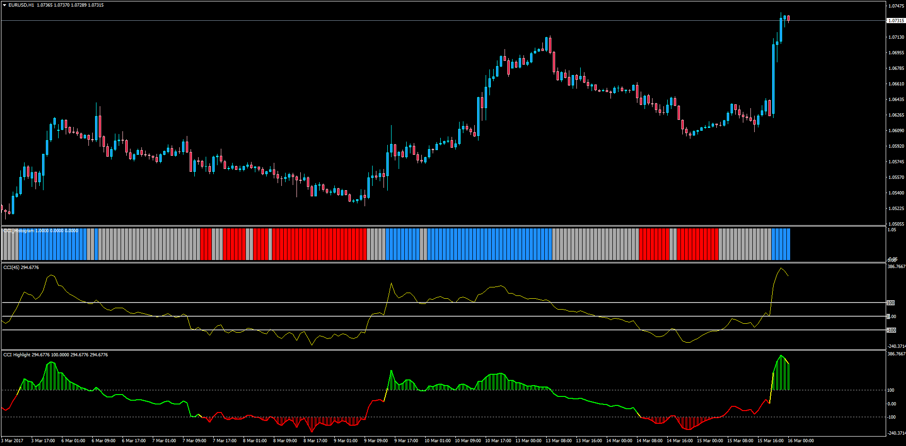

# CCI Histogram OB/OS

> Source: https://fxcodebase.com/code/viewtopic.php?f=38&t=64527  
> Forum: 38 · Topic 64527 · 1 post(s)

---

## CCI Histogram OB/OS

**Apprentice** · Thu Mar 16, 2017 4:53 am

Description:

This indicator was originally printing blue and red histogram colors depending the CCI line was above or below the zero line. Now instead, it colors in 3 ways: Above Over Bought Level, Below Over Sold Level, and Neutral.

Note: You might also want to check the CCI Highlight indicator that does something similar but inside the very CCI Indicator: [viewtopic.php?f=38&t=64112](https://fxcodebase.com/code/viewtopic.php?f=38&t=64112)

 [CCI_Histogram.mq4](files/111473/CCI_Histogram.mq4)
