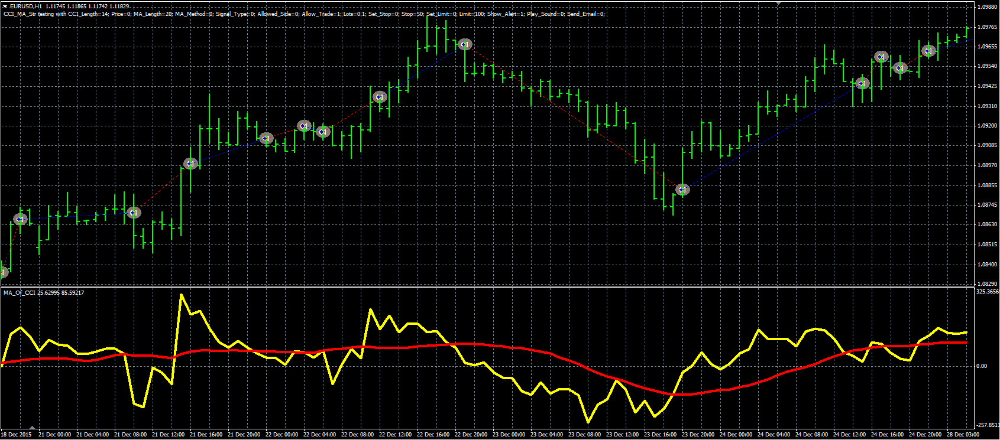

# CCI MA strategy

> Source: https://fxcodebase.com/code/viewtopic.php?f=38&t=63584  
> Forum: 38 · Topic 63584 · 1 post(s)

---

## CCI MA strategy

**Alexander.Gettinger** · Thu Jun 09, 2016 5:04 pm

The strategy based on the MA of CCI oscillator ([viewtopic.php?f=38&t=63572&p=106690](https://fxcodebase.com/code/viewtopic.php?f=38&t=63572&p=106690)).

Buy condition: CCI crosses above MA(CCI).
Sell condition: CCI crosses under MA(CCI).

 

Download:

 [CCI_MA_Str.mq4](files/106702/CCI_MA_Str.mq4)

The MA of CCI oscillator ([viewtopic.php?f=38&t=63572&p=106690](https://fxcodebase.com/code/viewtopic.php?f=38&t=63572&p=106690)) should be installed for correct work.
