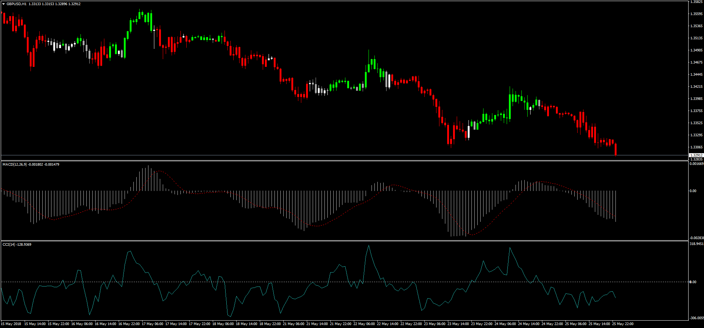

# CCI MACD Overlay

> Source: https://fxcodebase.com/code/viewtopic.php?f=38&t=66151  
> Forum: 38 · Topic 66151 · 1 post(s)

---

## CCI MACD Overlay

**Apprentice** · Sun May 27, 2018 6:24 pm

LUA Original: [viewtopic.php?f=17&t=8389](https://fxcodebase.com/code/viewtopic.php?f=17&t=8389)

Description:

MT4 version of the LUA original indicator that will color the candles according to the following conditions:

GREEN COLOR:

1. cci [period 14] > 0 and macd line > signal line

RED COLOR:

1. cci [ period 14] < 0 and macd line < signal line

NEUTRAL:

1. cci > 0 and macd line< signal line {or}
2. cci < 0 and macd line> signal line

 [CCI_MACD_Overlay.mq4](files/119372/CCI_MACD_Overlay.mq4)
