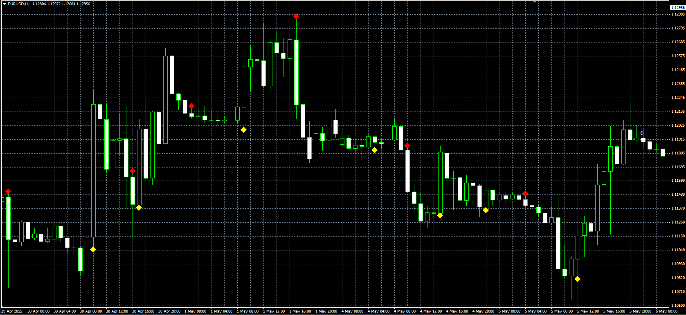

# CCI OBOS Crossover

> Source: https://fxcodebase.com/code/viewtopic.php?f=38&t=62200  
> Forum: 38 · Topic 62200 · 1 post(s)

---

## CCI OBOS Crossover

**Alexander.Gettinger** · Fri May 08, 2015 10:16 am

Original LUA indicator: [viewtopic.php?f=17&t=62049](https://fxcodebase.com/code/viewtopic.php?f=17&t=62049).

 

Download:

 [CCI_OBOS_Crossover.mq4](files/100362/CCI_OBOS_Crossover.mq4)

For this indicator, OBOS indicator ([viewtopic.php?f=38&t=23087&p=39787](https://fxcodebase.com/code/viewtopic.php?f=38&t=23087&p=39787)) should be installed.
