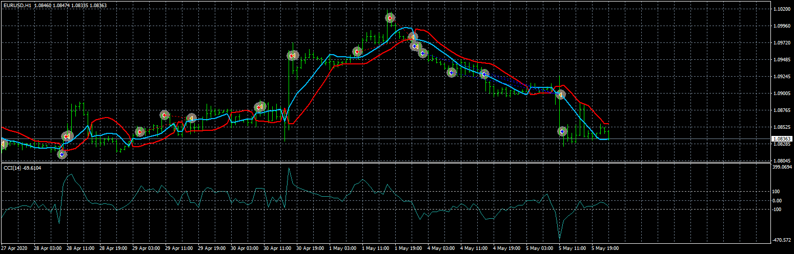
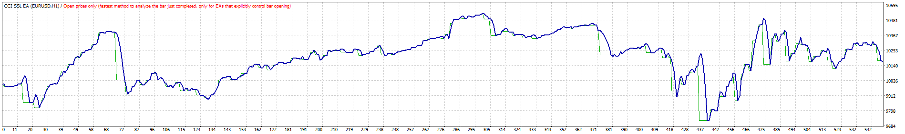
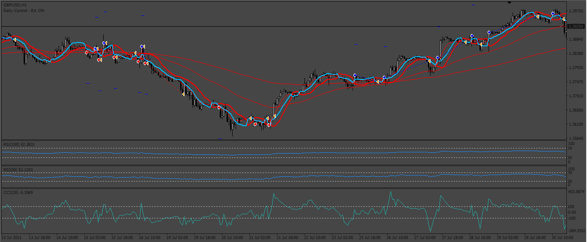
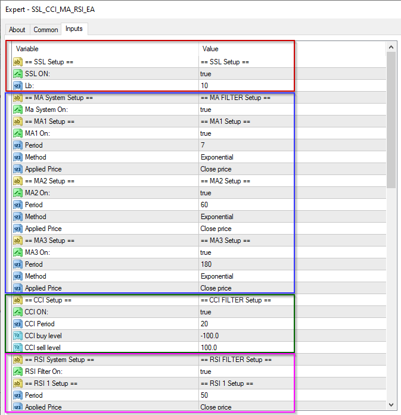
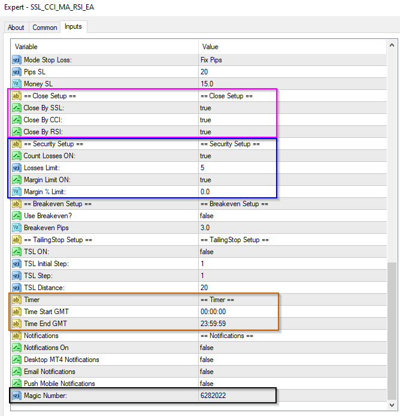
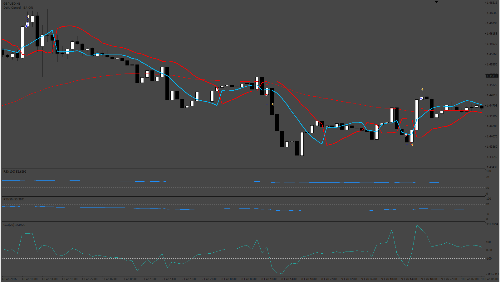
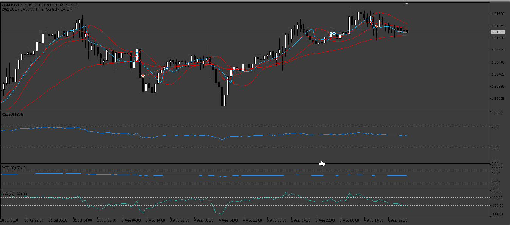
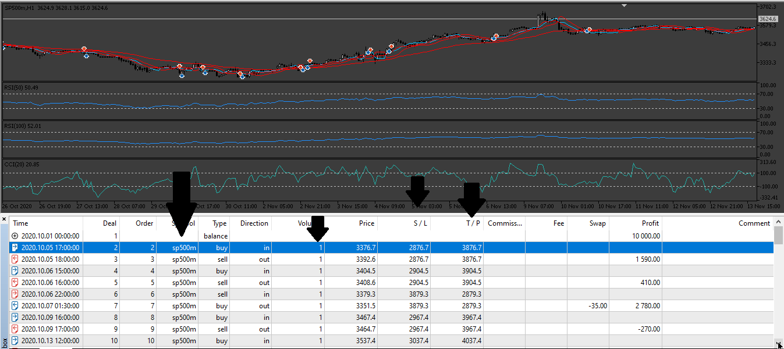

# CCI SSL EA

> Source: https://fxcodebase.com/code/viewtopic.php?f=38&t=70102  
> Forum: 38 · Topic 70102 · 26 post(s)

---

## CCI SSL EA

**Apprentice** · Tue Jun 30, 2020 3:30 am

 

Based on request.
[viewtopic.php?f=27&t=70089](https://fxcodebase.com/code/viewtopic.php?f=27&t=70089)

 [CCI SSL EA.mq4](files/135435/CCI%20SSL%20EA.mq4)

ssl-channel-chart-alert-indicator.mq4
[viewtopic.php?f=38&t=69212](https://fxcodebase.com/code/viewtopic.php?f=38&t=69212)

---

## Re: CCI SSL EA

**BTS0301** · Tue Jun 30, 2020 6:23 am

Thankyou, I'll give it a try!

---

## Re: CCI SSL EA

**wilson** · Mon Jun 06, 2022 5:47 am

Hello, I notice you have coded a CCI SSL EA in the last post. I have tried out this ea, it does not open position base on SSL if activate the CCI.

Can I request this from you.

Sorry for editing this post. I came up with a better ideas which is as follow:

This EA will consist of 2 engines or structures.

1. MA System
This system shows Long Term, Mid Term & Short Term Trend
By allowing settings to choose Simple Moving Average or Exponential Moving Average
Optional :
A. Short Term 7 Days default value
B. Mid Term : 60 Days default value
C. Long Term : 180 Days default value

Can put 0 to bypass any of the above.

MA System is Selectable - Can be True (Run as Base) or False (Do not use)

When it is set to true the MA System will act as the direction base for the EA if long term, mid term and short term trend is up trend then it only allows Buy position to be opened and the opposite way. If long term and mid term is up but short term is down trend then it will still open buy position.

User can choose
Short Term 0
Mid Term 0
Long Term 180 days

With this settings this EA will only recognize the Long Term trend because both short term and mid term has been set to 0 (disable)

2. SSL Channel System

This EA will not open position without SSL Channel. So this is the Heart of the system. If disable the MA system above this system still open position but will open both ways position (Buy and Sell) because it does not know the trend.

SSL Channel open position and close position as the primary indicator.

Optional:
Option 1
RSI: if activated
2 RSI line cross over to confirm the opening position either buy or sell

RSI 1 : 100 default value
RSI 2 : 50 default value

Option 2
CCI : if activated
CCI cross over to buy or sell
buy if ascending from < -100 break -100 and above
sell if descending from > 100 break lower to below 100
( I think this condition is important because if only code it as breakthrough it could be a descending from top to bottom and break the -100 it should not open any buy position because the trend is still going down. As well as selling position also having this problem. if previously is ascending to 100 then it open a sell position instead of a buy)

CCI default value : 20

This part will function this way :if disable RSI and CCI option, SSL will function alone. But when RSI is activated then it must meet both condition to open a position and when both RSI and CCI is activated. It must meet 3 conditions to open a position. Closing position can add an option either to use SSL + RSI or SSL + RSI + CCI to determine or just the SSL alone close position when it turns opposite.
If activate RSI and CCI then all 3 conditions must met in order to open a position. Open and close position function to be separated differently for example if you use SSL + RSI + CCI to open position. You can choose only SSL to close or SSL + RSI to close or all of them.

Note : After tested the existing version of SSL EA, I found the opening position has been a problem. The existing one allow choose live open position or after close of the current bar. If you choose live when the market is too volatile fluctuate up and down in that particular candle. The EA will open a position immediately then when next candle it went to the opposite way it will close and open another opposite position. This will create 3 to 4 positions keep on open and closing and result in making continuous losses. I suggest to be optional too like the previous EA which allow user to choose either live or after the bar close. And adding 1 more option at this part which is a lower time frame candle to determine the opening position for example if currently you are using 15 minutes time frame. By choosing a lower time frame to open position. The system will use 5 minutes SSL to determine the opening position either buy or sell.

Also stop trading once there is a continue lost of x times.
Or margin level drop x% (but withdrawal is not affected)

Also this EA must not automatically close other pair once activated the EA. Means 1 MT4 account can open several chart and run this EA but this EA will not close other position if detected any other position has already opened. This should be able to solve by adding magic number on each of the pair attached.

News Filter : Once there is major news then it will not open any position if activated this option.

Trading Time : Setting this will allow the EA only functioning during the designated time.

---

## Re: CCI SSL EA

**Apprentice** · Mon Jun 06, 2022 9:40 am

We have added your request to the development list.
Development reference 328.

---

## Re: CCI SSL EA

**wilson** · Thu Jun 16, 2022 9:41 am

I am eagerly waiting for it. Hope to get it soon and perform a test to see how it goes.

Cheers

---

## Re: CCI SSL EA

**Apprentice** · Wed Jun 29, 2022 7:57 am

 

 

 [SSL_CCI_MA_RSI_EA.mq4](files/146552/SSL_CCI_MA_RSI_EA.mq4)

Make sure you have ssl-channel-chart-alert-indicator.mq4 installed.
[viewtopic.php?f=38&t=69212](https://fxcodebase.com/code/viewtopic.php?f=38&t=69212)

---

## Re: CCI SSL EA

**wilson** · Wed Jun 29, 2022 9:08 pm

Thank you Apprentice. I am very excited to see how this EA works. Will test and see. Truly appreciate this.

---

## Re: CCI SSL EA

**jollyjegan** · Fri Jul 15, 2022 12:29 am

> **Apprentice wrote:**
>
>
> 328_pic.png
>
>
>
>
> 328_pic_setup1.png
>
>
>
>
> 328_pic_setup2.png
>
>
>
>
> SSL_CCI_MA_RSI_EA.mq4
>
>
>
> Make sure you have ssl-channel-chart-alert-indicator.mq4 installed.
> [viewtopic.php?f=38&t=69212](https://fxcodebase.com/code/viewtopic.php?f=38&t=69212)

Thanks Apprentice.. good effort ..

---

## Re: CCI SSL EA

**DVengeance** · Thu Aug 18, 2022 7:23 pm

Hi,

It does not seem to work, I get a critical error message - see atached.

Also, could I request the following additions:
- ATR based Sl/TP - ability to adjust ATR period and Multiplier
- Option for Reverse trading - Shorting on a Buy signal and Buying on a Sell signal

Thanks

---

## Re: CCI SSL EA

**Apprentice** · Fri Aug 19, 2022 4:38 am

We have added your request to the development list.
Development reference 500.

---

## Re: CCI SSL EA

**Apprentice** · Wed Aug 24, 2022 3:37 am

SSL_CCI_MA_RSI_EA.mq4 was updated.

---

## Re: CCI SSL EA

**wilson** · Sun Aug 28, 2022 3:35 am

Hello Apprentice,

you seems forgot to upload this updated version.

---

## Re: CCI SSL EA

**Apprentice** · Wed Aug 31, 2022 4:17 am

The file was updated, try to re-download it.
Try to use a different computer or browser.

---

## Re: CCI SSL EA

**DVengeance** · Tue Jan 03, 2023 7:39 pm

A few issues:

- it opens multiple positions when I have selected to only open one at a time

- opens a buy when it is not supposed to. If price is below the MA, no buy positions should open. The same behavior was for a sell, it shouldn't open when sell positions when price is above the MA.

---

## Re: CCI SSL EA

**Apprentice** · Sat Jan 07, 2023 6:05 am

We have added your request to the development list.
Development reference 16.

---

## Re: CCI SSL EA

**Apprentice** · Tue Jan 17, 2023 5:25 am

Try this version.

 [SSL_CCI_MA_RSI_EA_v2.mq4](files/149132/SSL_CCI_MA_RSI_EA_v2.mq4)

---

## Re: CCI SSL EA

**vishal12** · Tue Jan 17, 2023 10:43 am

Hi Sir
This is giving Error 'ssl-channel-chart-alert-indicator

---

## Re: CCI SSL EA

**Apprentice** · Fri Jan 20, 2023 12:05 pm

ssl-channel-chart-alert-indicator.mq4
[viewtopic.php?f=38&t=69212](https://fxcodebase.com/code/viewtopic.php?f=38&t=69212)

---

## Re: CCI SSL EA

**DVengeance** · Wed Mar 22, 2023 7:32 am

Works great.

Can we get it for MT5?

---

## Re: CCI SSL EA

**Apprentice** · Sat Mar 25, 2023 1:23 pm

We have added your request to the development list.
Development reference 274.

---

## Re: CCI SSL EA

**Apprentice** · Sat Apr 01, 2023 9:13 am

 [ssl-channel-chart-indicator.mq5](files/150232/ssl-channel-chart-indicator.mq5)

 [SSL_CCI_MA_RSI_EA_v2.mq5](files/150232/SSL_CCI_MA_RSI_EA_v2.mq5)

---

## Re: CCI SSL EA

**DVengeance** · Sat Apr 01, 2023 6:33 pm

Hey,

That was quick, but unfortunately it failed on my first most basic test - just SSL with TPSL, however, no matter what number of pips I enter, the EA uses something completely different - 200 points TP and 400 SL. Just seems to close the positions out of nowhere on the same or next candle.

*Could you also include a Time Range filter (hhmmss - hhmmss)?

Thanks

---

## Re: CCI SSL EA

**Apprentice** · Mon Apr 03, 2023 7:48 am

We have added your request to the development list.
Development reference 289.

---

## Re: CCI SSL EA

**Apprentice** · Sun Apr 23, 2023 2:53 pm

 [SSL_CCI_MA_RSI_EA_v3.mq5](files/150565/SSL_CCI_MA_RSI_EA_v3.mq5)

---

## Re: CCI SSL EA

**DVengeance** · Sun Apr 23, 2023 6:32 pm

Hi,

Upon basic testing, it is behaving strangely again. I have literally only set the SSL as entry, one MA for a filter, fixed lot of 1 and TP and SL at 800 points, time filter of 2 hours.

So as per my settings, positions should only close upon reaching TP or SL.

However, the EA closes some positions prematurely at the next candle open.

If the next candle is against the position it closes the position almost always, which is not in any of the closing conditions in the inputs.

Also, the Account Percent lot option does not work - I get an invalid volume error on the above mentioned settings. I looked through the code, seems to be missing the userSLpips from the calculation and also SYMBOL_VOLUME_MIN and SYMBOL_VOLUME_MAX.

---

## Re: CCI SSL EA

**Apprentice** · Sun May 07, 2023 3:35 am

[SSL_CCI_MA_RSI_EA_v4.mq5](files/150728/SSL_CCI_MA_RSI_EA_v4.mq5)

Try this version.
