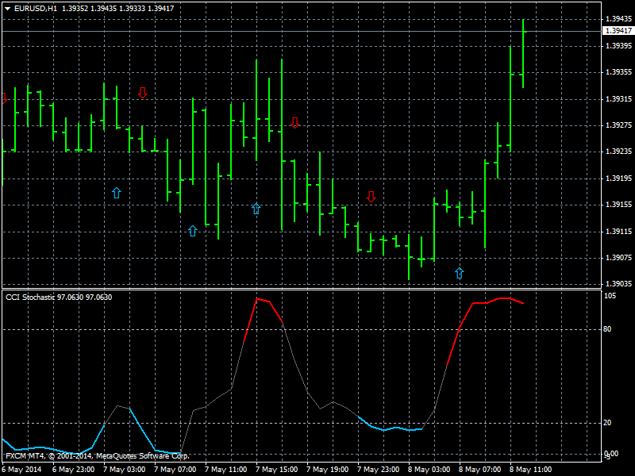

# CCI Stochastic

> Source: https://fxcodebase.com/code/viewtopic.php?f=38&t=60664  
> Forum: 38 · Topic 60664 · 10 post(s)

---

## CCI Stochastic

**Apprentice** · Thu May 08, 2014 4:34 am

Based on the request.
[viewtopic.php?f=27&t=60656&p=93910#p93910](https://fxcodebase.com/code/viewtopic.php?f=27&t=60656&p=93910#p93910)

 [CCI Stochastic.mq4](files/93909/CCI%20Stochastic.mq4)

 [CCI - Nrp - Mtf Advanced Alerts.mq4](files/93909/CCI%20-%20Nrp%20-%20Mtf%20Advanced%20Alerts.mq4)

---

## Re: CCI Stochastic

**jay1994** · Mon May 12, 2014 12:16 am

Hi Apprentice. I did some forward testing with this indicator and the arrows do re-paint sometimes. Is there anyway to make this indicator non-repaint? So once the arrows appear they don't disappear. I'll be looking forward to your response, thanks so much

---

## Re: CCI Stochastic

**Apprentice** · Tue May 13, 2014 1:35 am

I am not the author of this indicator / algorithm.
Can you suggest a workaround.

---

## Re: CCI Stochastic

**jay1994** · Tue May 13, 2014 3:01 am

> **Apprentice wrote:**
> I am not the author of this indicator / algorithm.
> Can you suggest a workaround.

Oh, ok. Basically, I don't want the arrows to disappear(re-paint) once they appear. Similar to the attached indicators.

---

## Re: CCI Stochastic

**jay1994** · Thu May 15, 2014 3:54 am

Is a non-repaint version possible with this indicator?

---

## Re: CCI Stochastic

**jay1994** · Mon May 19, 2014 1:27 am

Do you think you can accomplish this Apprentice? If not I can just use the normal one and wait until after the arrow closes

---

## Re: CCI Stochastic

**Apprentice** · Mon May 19, 2014 2:38 am

[CCI Stochastic.mq4](files/94071/CCI%20Stochastic.mq4)

Try this version.
I have introduced IgnoreLastPeriod Parameter.

---

## Re: CCI Stochastic

**jay1994** · Mon May 19, 2014 3:12 am

> **Apprentice wrote:**
>
>
> CCI Stochastic.mq4
>
>
> Try this version.
> I have introduced IgnoreLastPeriod Parameter.

Thanks a lot man! This is EXACTLY what I wanted much appreciated!

---

## Re: CCI Stochastic

**Coondawg71** · Sat Jun 21, 2014 11:06 am

Can we please request a Lua version of this CCI Stochastic indicator.

Thank you,

sjc

---

## Re: CCI Stochastic

**Apprentice** · Mon Jun 23, 2014 3:27 am

Requested can be found here.
[viewtopic.php?f=17&t=60838](https://fxcodebase.com/code/viewtopic.php?f=17&t=60838)
