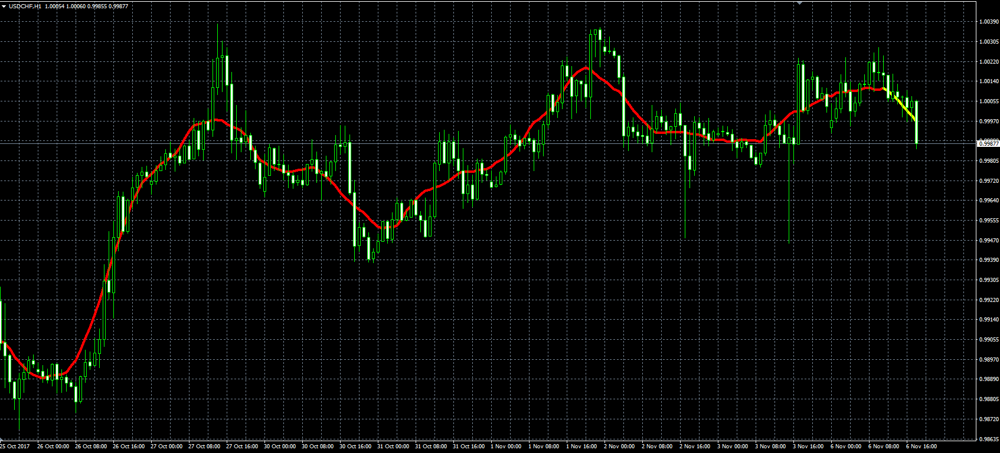

# Centred moving average

> Source: https://fxcodebase.com/code/viewtopic.php?f=38&t=65339  
> Forum: 38 · Topic 65339 · 2 post(s)

---

## Centred moving average

**Alexander.Gettinger** · Mon Nov 06, 2017 1:35 pm

Original LUA indicator: [viewtopic.php?f=17&t=24476](https://fxcodebase.com/code/viewtopic.php?f=17&t=24476).

> This indicator is basically a simple moving average,
> if compared with the original, there is a notable reduction in lag time,
> last Period/2 values are just a projection of possible future SMA values.

 

Download:

 [CMA.mq4](files/115899/CMA.mq4)

---

## Re: Centred moving average

**projection** · Sun Dec 03, 2017 1:37 am

Thanks a lot Alexander!

Regards,
Projection
