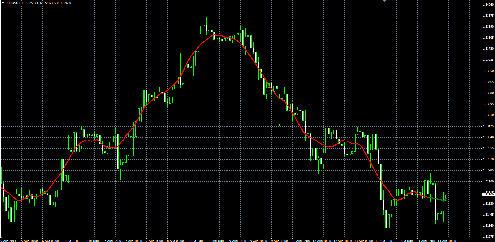

# Centred moving average

> Source: https://fxcodebase.com/code/viewtopic.php?f=38&t=59119  
> Forum: 38 · Topic 59119 · 2 post(s)

---

## Centred moving average

**Alexander.Gettinger** · Wed Aug 14, 2013 2:26 pm

Original LUA indicator: [http://fxcodebase.com/code/viewtopic.php?f=17&t=24476](https://fxcodebase.com/code/viewtopic.php?f=17&t=24476).

Formulas:
CMA[i] = SMA[i+Length/2] for all bars except the last Length/2 bars,
CMA[i] = (Sum of the prices(from (i-Length/2) to last bar)+(Last bar price)*(Length/2-i-1))/Length.

 

Download:

 [CMA.ex4](files/88567/CMA.ex4)

---

## Re: Centred moving average

**Apprentice** · Thu Jun 16, 2016 3:25 am

Bump up.
