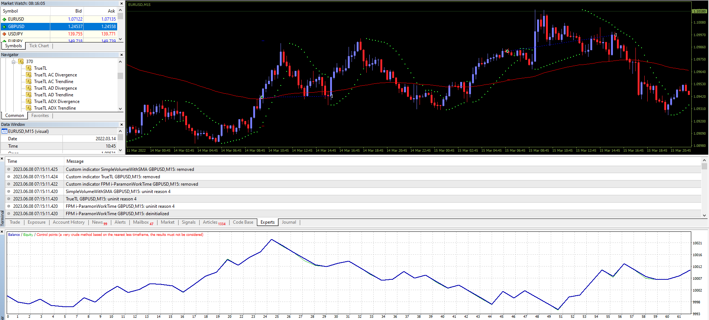

# CHAMP_EA_v1.00

> Source: https://fxcodebase.com/code/viewtopic.php?f=38&t=73804  
> Forum: 38 · Topic 73804 · 3 post(s)

---

## CHAMP_EA_v1.00

**Apprentice** · Wed Jun 07, 2023 7:36 am

Based on the request.
[https://fxcodebase.com/code/viewtopic.php?f=38&p=150341](https://fxcodebase.com/code/viewtopic.php?f=38&p=150341)

 [CHAMPION Holy Grail Tool.ex4](files/151154/CHAMPION%20Holy%20Grail%20Tool.ex4)

 [CHAMP_EA_v1.00.mq4](files/151154/CHAMP_EA_v1.00.mq4)

---

## Re: CHAMP_EA_v1.00

**samuel84** · Mon Jun 09, 2025 12:25 pm

Not sure why but the indicator can't be loaded when trying to backtest or even add onto chart. Tried changing filename to as per stated in the code of the expert but still can't work.

---

## Re: CHAMP_EA_v1.00

**Apprentice** · Thu Jun 12, 2025 4:03 am

The indicator file doesn't work. I searched on the web for the indicator, but I can’t find anything useful.
