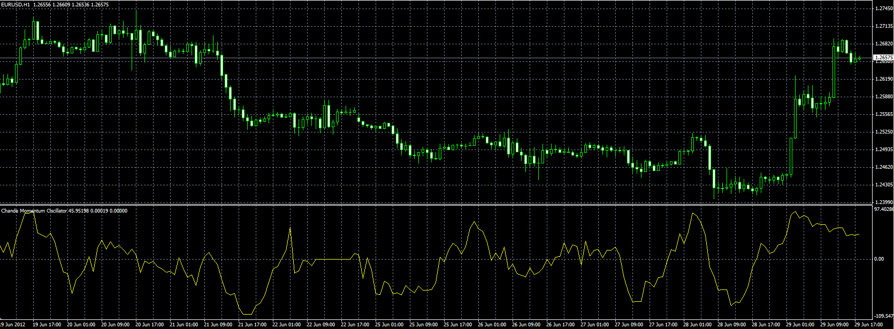

# Chande Momentum Oscillator

> Source: https://fxcodebase.com/code/viewtopic.php?f=38&t=20681  
> Forum: 38 · Topic 20681 · 1 post(s)

---

## Chande Momentum Oscillator

**Alexander.Gettinger** · Fri Jun 29, 2012 1:50 pm

Formulas:
CMO=(s1-s2)/(s1+s2)*100, where
s1=SMA(cmo1) with Length as period,
s2=SMA(cmo2) with Length as period,
cmo1 - sum of positive deviation of price,
cmo2 - sum of negative deviation of price.

 

Download:

 [CMO.mq4](files/36263/CMO.mq4)
