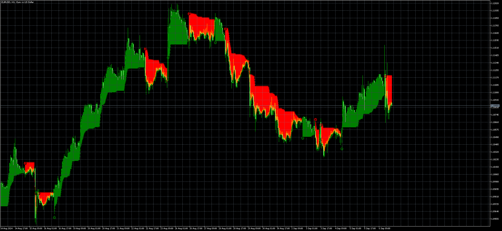

# Chandelier_Exit

> Source: https://fxcodebase.com/code/viewtopic.php?f=38&t=75191  
> Forum: 38 · Topic 75191 · 5 post(s)

---

## Chandelier_Exit

**Apprentice** · Sun Sep 08, 2024 3:20 pm

Based on the request.
[https://fxcodebase.com/code/viewtopic.p ... 99#p155599](https://fxcodebase.com/code/viewtopic.php?f=27&p=155599#p155599)

 [Chandelier_Exit.mq5](files/156610/Chandelier_Exit.mq5)

 [Chandelier_Exit.mq4](files/156610/Chandelier_Exit.mq4)

---

## Re: Chandelier_Exit

**logicgate** · Wed Oct 02, 2024 5:52 am

Thanks!!

---

## Re: Chandelier_Exit

**logicgate** · Tue Dec 03, 2024 9:06 am

Dear friend apprentice, can we get a MT4 version too, please?

Best regards

---

## Re: Chandelier_Exit

**Apprentice** · Thu Dec 05, 2024 1:24 pm

We have added your request to the development list.
Development reference 889

---

## Re: Chandelier_Exit

**Apprentice** · Mon Dec 30, 2024 6:57 pm

MT4 version added.
