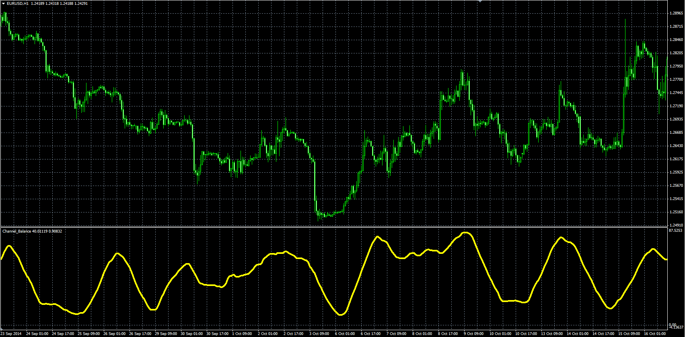

# Channel Balance

> Source: https://fxcodebase.com/code/viewtopic.php?f=38&t=61538  
> Forum: 38 · Topic 61538 · 1 post(s)

---

## Channel Balance

**Alexander.Gettinger** · Tue Nov 25, 2014 11:18 am

Original LUA oscillator: [viewtopic.php?f=17&t=3941](https://fxcodebase.com/code/viewtopic.php?f=17&t=3941).

Formula:
CB = 100*MVA(T), where
T = (Median price - Min)/Range,
Range = Max - Min,
Max, Min - maximum and minimum prices at range from (i-Length+1) to (i).

 

Download:

 [Channel_Balance.mq4](files/97367/Channel_Balance.mq4)
