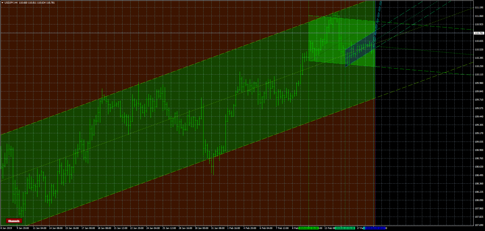

# channels

> Source: https://fxcodebase.com/code/viewtopic.php?f=38&t=67368  
> Forum: 38 · Topic 67368 · 5 post(s)

---

## channels

**Apprentice** · Tue Feb 19, 2019 7:21 am

Based on request.
[viewtopic.php?f=27&t=67359](https://fxcodebase.com/code/viewtopic.php?f=27&t=67359)

 [channels.mq4](files/124012/channels.mq4)

---

## Re: channels

**TheGMan** · Tue Feb 19, 2019 6:47 pm

This is perfect!

Thank you, Apprentice!

---

## Re: channels

**TheGMan** · Thu Feb 21, 2019 9:40 am

Hi Apprentice

Everything is great with the button that was added except one thing...the indicator turns on when you switch time frames. Could you please correct this so that it does not turn on when switching time frames?

Thank you!

---

## Re: channels

**Apprentice** · Wed Feb 27, 2019 6:17 am

Try it now.

---

## Re: channels

**TheGMan** · Wed Feb 27, 2019 5:47 pm

> **Apprentice wrote:**
> Try it now.

This is great! Thanks again Apprentice you and your coders are the best!

G
